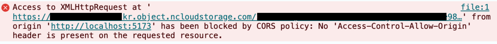

+++++++

### 회사에서 프로젝트를 진행하던 중, 대용량 파일을 업로드 해야하는 일이 발생하였다.

우리는 NCP의 Object Storage를 쓰고있었고, Java + Spring Boot를 이용해 aws SDK를 사용하던 중이었다.  
해당 부분을 담당하던 팀원은 Presigned Url을 생성하여 파일을 업로드 하는 기능을 채택하였고, 작업은 아래 우형 기술 블로그를 참조하여 개발되었다. 

- **Presigned Url 업로드 기능 설명**

[NCP UploadPart Docs URL](https://api.ncloud-docs.com/docs/storage-objectstorage-uploadpart)

[AWS S3 PresignedUrl Sample URL](https://docs.aws.amazon.com/AmazonS3/latest/API/s3_example_s3_Scenario_PresignedUrl_section.html)

- **Spring Boot에서 S3에 파일을 업로드하는 세 가지 방법**

[https://techblog.woowahan.com/11392/](https://techblog.woowahan.com/11392/)

곧 담당 팀원이 외부 파견을 나갔고..  담당자는 내가 되었다. 그리고 해당 API를 프론트에서 호출하는 중에 에러가 발생하였다.



```bash
Access to XMLHttpRequest at 'https:/(중략).kr.object.ncloudstorage.com/(생략)' from origin 'http://localhost:5173' has been blocked by CORS policy: No 'Access-Control-Allow-Origin' header is present on the requested resource.
```


뭔지도 모르는데 일단 디버깅을 시작한 나.. 

에러 내용을 보면 알 수 있듯이 우리 서버를 호출하는 것이 아닌 이전에 서버에서 NCP를 통해 생성한 Presigned URL을 호출할 때 CORS가 발생하였다.

아무래도 프론트에서 인증없이 호출하고 있었기 때문에 *‘Object Storage에 Cors를 설정해야겠다.’* 생각하였고, 마침 참고 했었던 블로그에 CORS 설정을 해야한다는 이야기가 있었기 때문에 그대로 시도했다. 

## AWS CLI를 이용하여 Bucket의 CORS 설정 하는 방법

 NCP가 AWS CLI와 SDK를 호환하고 있다.

1. **Cors 설정 파일을 작성한다.**

```bash
hongjieun@hongjieunkkeo ~ % vi cors-config.json
```

Presigned URL 생성시 PUT 메서드를 받는 URL을 만들겠다고 설정해서 
Method에는 PUT을 넣어주었다. 

```jsx
{
    "CORSRules": [
        {
            "AllowedHeaders": [
                "*"
            ],
            "AllowedMethods": [
                "PUT",
            ],
            "AllowedOrigins": [
                "*"
                //원래 실제 호출하는 주소를 넣어야 함.
            ],
            "ExposeHeaders": [
                "ETag"
            ],
            "MaxAgeSeconds": 3000
        }
    ]
}

```

2. **만들어진 Cors 설정 파일을 AWS CLI를 이용해 설정한다.**

```bash
hongjieun@hongjieunkkeo ~ % aws configure
```

계정 설정 먼저 진행한다 (accesskey/password)

```bash
hongjieun@hongjieunkkeo ~ % aws --endpoint-url=https://kr.object.ncloudstorage.com s3api put-bucket-cors --bucket (여러분의 버킷 명을 입력하세요) --cors-configuration file://cors-config.json
```

조금 전에 만든 파일을 업데이트 한다. 

(이때 계정의 권한이 없거나 잘못된 버킷을 입력하면 에러메세지가 나온다~)
(추가적으로 endpoint-url 은 aws는 aws의 url 로 입력해주어야 한다)

3. **제대로 올라갔는지 확인한다.**

```bash
hongjieun@hongjieunkkeo ~ % aws --endpoint-url=https://kr.object.ncloudstorage.com s3api get-bucket-cors --bucket (여러분의 버킷 명을 입력하세요)
```

해당 명령어를 입력하면 버킷에 설정한 Cors 설정 정보를 알 수 있다. 

이제 문제가 없으니, 프론트 분께 재시도를 요청드렸다.

결과는 … 아직도 동일한 CORS 에러..!!!!!!!!!!!!!!!!


흑 인프라팀에 요청해서 CORS 설정 넣는 것도 꽤 대기 했는데 해결이 되지 않아 마음이 쓰렸다. 

모든 설정에는 문제가 없는데 대체 뭐가 문제일까 여러 방면으로 디버깅을 진행하였다. 

- **Presigned URL 생성 부분에서 문제가 있나 싶어 백엔드 코드를 확인해보고,**
- **URL이 유효한가? POSTMAN으로 찔러도 보고.. (Cors는 브라우저가 내는 에러이기 때문에 성공했다. 다만 적어도 기능 상에 문제가 없다는 것을 알게되었다.)**
- **나중에는 CORS 설정 권한을 직접 받아서 CORS 설정 파일의 내용을 바꾸면서 테스트를 진행했다.**

**CORS 에러는 Preflight 요청에서 발생한다.**

**Preflight 요청은 OPTIONS 메서드로 실행된다.** 

**그래서 Cors 설정 파일에 OPTIONS 메서드를 추가해보기로 했다.** 

```jsx
{
    "CORSRules": [
        {
            "AllowedHeaders": [
                "*"
            ],
            "AllowedMethods": [
                "PUT", "OPTIONS", "GET", "POST"
            ],
            "AllowedOrigins": [
                "*"
                //원래 실제 호출하는 주소를 넣어야 함.
            ],
            "ExposeHeaders": [
                "ETag"
            ],
            "MaxAgeSeconds": 3000
        }
    ]
}
```

AllowedMethods에 OPTIONS를 추가했다. (무지성으로 다른 메서드도 다 넣어봤다.)

```bash
hongjieun@hongjieunkkeo ~ % aws --endpoint-url=https://kr.object.ncloudstorage.com s3api put-bucket-cors --bucket (여러분의 버킷 명을 입력하세요) --cors-configuration file://cors-config.json

An error occurred (InvalidRequest) when calling the PutBucketCors operation: OPTIONS is not an accepted AllowedMethod for CORS configurations
```

그리고 적용하려고 보니 웬걸.. Cors 설정 파일에 OPTIONS 메서드를 지원하지 않는다.

(억울)

그럼 CORS 에러 해결 못하나 ? 

**다시 생각해보자.** 

**Preflight OPTIONS 요청이 왜 가지? (이것이 포인트다)**


[https://developer.mozilla.org/en-US/docs/Web/HTTP/CORS#simple_requests](https://developer.mozilla.org/en-US/docs/Web/HTTP/CORS#simple_requests)

Preflight가 나가지 않는 요청을 **Simple Requests** 라고 한다. 

가능한 조건은 아래와 같다. 

> 
> 
> - One of the allowed methods:
>     - [`GET`](https://developer.mozilla.org/en-US/docs/Web/HTTP/Methods/GET)
>     - [`HEAD`](https://developer.mozilla.org/en-US/docs/Web/HTTP/Methods/HEAD)
>     - [`POST`](https://developer.mozilla.org/en-US/docs/Web/HTTP/Methods/POST)
> - Apart from the headers automatically set by the user agent (for example, [`Connection`](https://developer.mozilla.org/en-US/docs/Web/HTTP/Headers/Connection), [`User-Agent`](https://developer.mozilla.org/en-US/docs/Web/HTTP/Headers/User-Agent), or [the other headers defined in the Fetch spec as a *forbidden header name*](https://fetch.spec.whatwg.org/#forbidden-header-name)), the only headers which are allowed to be manually set are [those which the Fetch spec defines as a CORS-safelisted request-header](https://fetch.spec.whatwg.org/#cors-safelisted-request-header), which are:
>     - [`Accept`](https://developer.mozilla.org/en-US/docs/Web/HTTP/Headers/Accept)
>     - [`Accept-Language`](https://developer.mozilla.org/en-US/docs/Web/HTTP/Headers/Accept-Language)
>     - [`Content-Language`](https://developer.mozilla.org/en-US/docs/Web/HTTP/Headers/Content-Language)
>     - [`Content-Type`](https://developer.mozilla.org/en-US/docs/Web/HTTP/Headers/Content-Type) (please note the additional requirements below)
>     - [`Range`](https://developer.mozilla.org/en-US/docs/Web/HTTP/Headers/Range) (only with a [simple range header value](https://fetch.spec.whatwg.org/#simple-range-header-value); e.g., `bytes=256-` or `bytes=127-255`)
> - The only type/subtype combinations allowed for the [media type](https://developer.mozilla.org/en-US/docs/Glossary/MIME_type) specified in the [`Content-Type`](https://developer.mozilla.org/en-US/docs/Web/HTTP/Headers/Content-Type) header are:
>     - `application/x-www-form-urlencoded`
>     - `multipart/form-data`
>     - `text/plain`
> - If the request is made using an [`XMLHttpRequest`](https://developer.mozilla.org/en-US/docs/Web/API/XMLHttpRequest) object, no event listeners are registered on the object returned by the [`XMLHttpRequest.upload`](https://developer.mozilla.org/en-US/docs/Web/API/XMLHttpRequest/upload) property used in the request; that is, given an [`XMLHttpRequest`](https://developer.mozilla.org/en-US/docs/Web/API/XMLHttpRequest) instance `xhr`, no code has called `xhr.upload.addEventListener()` to add an event listener to monitor the upload.
> - No [`ReadableStream`](https://developer.mozilla.org/en-US/docs/Web/API/ReadableStream) object is used in the request.

간단하게 정리하면, **GET/HEAD/POST 메서드 요청이고, 기본 헤더(아래 명시된)만 사용하여 요청을 보낼 경우 Simple Requests가 될 수 있다고 한다.** 

PUT을 쓰는 우리는 당연히 Preflight 요청이 나갈거고, OPTIONS 메서드를 허용하지 않는 AWS or NCP는 CORS 에러를 발생시킬 것이다. 

근데 이상하다? 우리가 참조한 블로그의 예제와 AWS의 Sample Code에는 PUT 메서드로 Presigned URL을 생성하는데 문제 없이 클라이언트에서 요청이 성공하고 있었다. 

`( AWS SDK의 generatePresignedUrl 을 이용하여 URL을 생성하는 예제 코드)`

[https://github.com/awsdocs/aws-doc-sdk-examples/blob/main/java/example_code/s3/src/main/java/aws/example/s3/GeneratePresignedUrlAndUploadObject.java](https://github.com/awsdocs/aws-doc-sdk-examples/blob/main/java/example_code/s3/src/main/java/aws/example/s3/GeneratePresignedUrlAndUploadObject.java)

무슨 차이가 있지 ??

그때 프론트 개발자 분이 나를 불렀다. 

> 성공했어요
> 

> ???? 대체 어떻게… ????
> 

그렇다. 프론트에서 기본적으로 인증을 위해 Header에 Authorization을 넣는 공통 요청함수를 만들었고.  

AWS API 통신도 공통 함수로 호출 했던 것이었다.

Authorization은 인증을 위한 대표적인 헤더로, 민감성 정보기 때문에 Preflight 요청을 무적권(아닐지도..)보낸다. 

하지만 PreSigned URL API에는 Authorization을 필요로 하지 않는다.

프론트 개발자 분께서는 Header 에 Authorization을 제거한 함수를 개별로 생성해서 해당 함수로 호출하니 Preflight 요청 없이 바로 PUT API를 부른 것이었다!!!!!!!!!!!!!!!!!!!!!!!!!!!!!!!!!!1

**유레카**


<aside>


**##💡 5줄 정리** 

1. `NCP Cors 설정에서 method 중 OPTIONS method 타입은 지원하지 않고 있음`

2. `프론트에서는 api를 보낼때 인증용 Authorization 헤더를 공통적으로 보내고 있었음`

3. `Authorization 헤더와 같은 민감 헤더가 포함된 경우, 브라우저에서 preflight 요청을 보냄`

4. `따라서 모든 method와 origin을 허용해도 preflight로 보내는 OPTIONS 요청에서 cors 에러가 발생`

5. `공통적으로 사용하는 요청 함수를 분리하여 header에 Authorization 헤더를 제거하고 요청하니 Preflight 요청 없이 성공`

</aside>

충분히 좀 더 빠르게 해결 할 수 있었는데 OPTIONS 메서드를 허용하지 않는다는 에러 메서지를 간과한 것이 디버깅 지연 원인이 되었다.

*~~블로그에는 차분하게 글을 정리해두었지만, 현실에서는 냅다 이것저것 넣고 빼고 쇼를 했다.~~* 

대신 다음부터는 CORS Preflight 이슈에 더 빠르게 대응할 수 있을 것 같다는 생각이 든다. 

까먹지 말라고 오랜만에 블로그 글까지 쓰니까…

---

같이 디버깅 해준 프론트 개발자 H님과

정확한 원인을 찾을 수 있도록 지식을 공유해주신 J님께 감사하다는 말을 남기고 싶습니다.

따봉 J님 H님 고마워요~! 


---

## 참고 사이트

[https://api.ncloud-docs.com/docs/storage-objectstorage-uploadpart](https://api.ncloud-docs.com/docs/storage-objectstorage-uploadpart)
https://docs.aws.amazon.com/AmazonS3/latest/API/s3_example_s3_Scenario_PresignedUrl_section.html
[https://techblog.woowahan.com/11392/](https://techblog.woowahan.com/11392/)
[https://developer.mozilla.org/en-US/docs/Web/HTTP/CORS#simple_requests](https://developer.mozilla.org/en-US/docs/Web/HTTP/CORS#simple_requests)
https://velog.io/@jh100m1/CORS-%EC%97%90%EB%9F%AC%EA%B0%80-%EB%AD%94%EB%8D%B0-%EC%96%B4%EB%96%BB%EA%B2%8C-%ED%95%B4%EA%B2%B0%ED%95%98%EB%8A%94%EA%B1%B4%EB%8D%B0