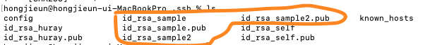
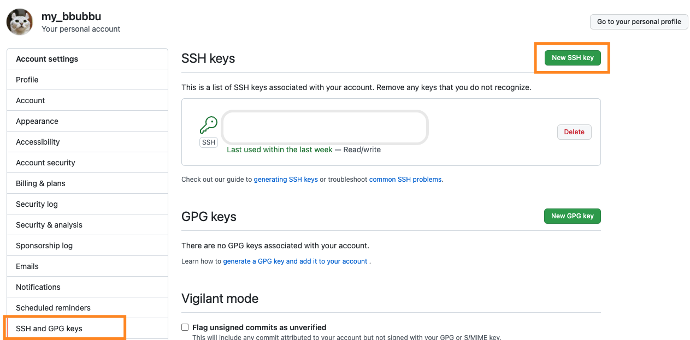
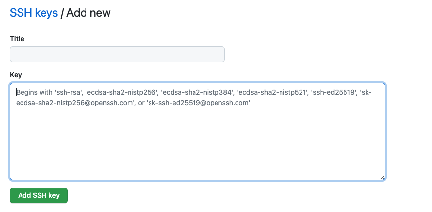
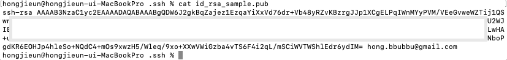
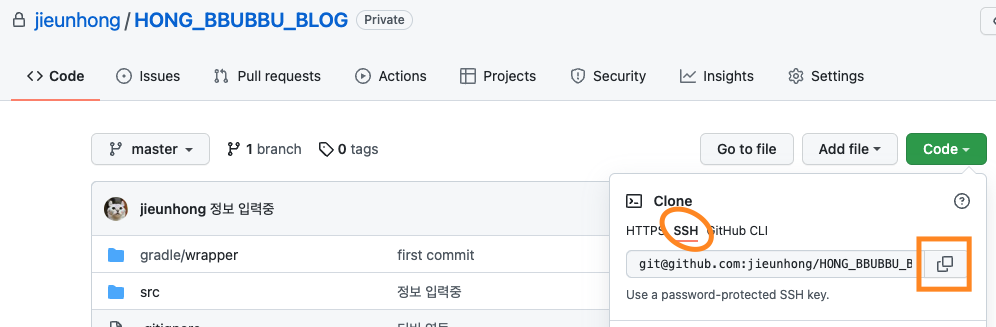

+++++++


일을 하다보면 git계정을 여러개 써야하는 경우가 생깁니다.   
특히 private repository인 경우에는 깃 작업시마다 계정을 바꿔줘야해서 굉장히~~~
번거롭고 귀찮습니다.   
그런 사람들을 위해 똑똑한 사람들이 이미 기능을 만들었더라구요.
   
      

```jsx
mkdir ~/.ssh
```
루트 경로에 .ssh폴더가 없는 경우 mkdir로 폴더를 만들어주세요.
   
```jsx
cd ~/.ssh
```
.ssh 폴더로 접근합니다.
   
```jsx
ssh-keygen -t rsa -C "hong.bbubbu@gmail.com" -f "id_rsa_self"
```
ssh 키를 생성해줍니다.    
"hong.bbubbu@gmail.com"을 자신의 이메일로 변경해주세요.   
"id_ rsa_ self"는 생성될 키의 이름입니다. 원하는 명칭으로 변경해주세요.

   
```jsx
Generating public/private rsa key pair.
Enter passphrase (empty for no passphrase): 
Enter same passphrase again: 
Your identification has been saved in id_rsa_self.
Your public key has been saved in id_rsa_self.pub.
The key fingerprint is:
SHA256:4C4+VoDB4auTNBdEE3nlnsl4Pb2R2FIfrLZwJuQ3tlk hong.bbubbu@gmail.com
The key's randomart image is:
+---[RSA 3072]----+
| .o*o ..         |
| .+....     .    |
|  .+. .. . . o   |
|  ..o.+.* = + .  |
| o.. o.*SO & E   |
|.oo  .o   @ O    |
|+   ...    =     |
| . .o.           |
|   ...           |
+----[SHA256]-----+
```
그러면 이렇게 나오게 됩니다.   
Enter passphrase (empty for no passphrase):    
암호를 입력하라고 나오는데 그냥 엔터 누르셔도 됩니다.   
저는 암호 등록했어요!(등록하면 나중에 key 사용시마다 암호 입력이 필요합니다.)
   
*저는 회사와 개인 계정 분리를 위해 2개의 키를 생성해주었습니다.*
   


ls 구문으로 확인해보면 key가 생성되었습니다.   
.key와 -pub.key 2개가 1쌍입니다.


```jsx
vi config
```
키를 등록합시다.
vi로 config파일을 작성합니다.
   
```jsx
    Host github.com-self    //github.com-(명칭)
    HostName github.com
    User git
    IdentityFile ~/.ssh/id_rsa_self //생성한 키 명칭 입력

    Host github.com-huray    //github.com-(명칭)
    HostName github.com
    User git
    IdentityFile ~/.ssh/id_rsa_huray //생성한 키 명칭 입력
```
HOST부분과 IdentityFile에서 끝부분을 각자 변경해주시면 됩니다.   
편집 완료 후에 github에 로그인합니다.
   

Account Settings에서 SSH and GPG keys 메뉴를 들어갑니다.   
흰 상자 부분은 제가 미리 등록해놓은 SSH키 입니다.
New SSH Key를 눌러주시고
   



```jsx
cat id_rsa_self.pub
```
생성한 SSH키의 pub파일을 cat으로 읽어 안에 내용을 모두 복사해서
key부분에 복사해줍니다.   
title은 알아서 적어주세요~
(!참고로 깃허브 계정과 키가 서로 일치하게 등록해주세요 )
   
**이것도 키 수에 맞게 계정별로 등록해주셔야합니다.**   
*저는 회사계정, 개인계정 2번 등록했습니다.*
   

```jsx
ssh -T git@github.com-self
```
깃허브에 등록을 완료하면 ssh명령어를 이용해 확인을 해줍니다.
   
```jsx
Enter passphrase for key '/Users/hongjieun/.ssh/id_rsa_self': 
Hi jieunhong! You've successfully authenticated, but GitHub does not provide shell access.
```
뭐가 나와서 yes를 입력하면 이렇게 나옵니다   
그러면 성공! ( 암호 등록하신 분들은 암호 입력하라고 나와요 )
   

그리고 이제 git project clone받으실때 ssh 주소를 복사합니다.
   
```jsx{3}
git@github.com:jieunhong/jieunhong.github.io.git

git@github.com-self:jieunhong/jieunhong.github.io.git
```
복사한 주소에서 git@github.com 바로 옆에 ssh config파일에 등록한 설정명을 적어줍니다.
   


```jsx
git clone git@github.com-self:jieunhong/jieunhong.github.io.git
```
이렇게 클론하시면 끝!
   

```jsx
git remote set-url origin git@github.com-self:jieunhong/jieunhong.github.io.git
```
기존에 있던 프로젝트는 위에 명령어로 변경 가능합니다.
   

이어지는 게시글입니다 !    
[git 계정 정보 프로젝트 별로 관리하기(.gitconfig)](/git-multi-config2/) 
   

---

* 퇴근하자

---
