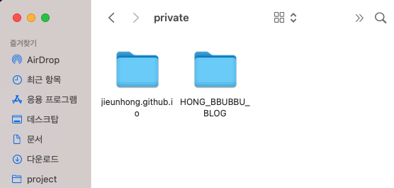

+++++++

[한 컴퓨터에서 Git계정 여러개 설정하기(ssh)](/git-multi-config/)    
에서 이어지는 게시글 입니다.   

깃 commit을 할 때!    
컴퓨터에 등록된 전역 계정 정보가 등록되어서 
곤란한 적 있으셨나요?   
프로젝트별로 계정을 바꿔주는 것도 너무 귀찮고..   

그럴때! .gitconfig를 커스텀해서 바꿔봅시다!   

```jsx
cd ~
```
루트 폴더로 이동해줍니다.
   
```jsx
vi ~/.gitconfig
```
.gitconfig파일을 열어서 편집을 해줍시다.
   
```jsx{11,12}
[filter "lfs"]
        clean = git-lfs clean -- %f
        smudge = git-lfs smudge -- %f
        process = git-lfs filter-process
        required = true
[user]
        name = company-jieun
        email = jieun.hong@company.com


[includeIf "gitdir:~/project/private/"]
        path = .gitconfig-self
```
아래에 표시되어있는 2개 줄을 복사해주세요.   
includeIf "gitdir:~/project/private/"    
여기에 전역 계정 말고 커스텀으로 표시하고 싶은 프로젝트 경로를 넣어주세요
   
path = .gitconfig-self   
path에는 커스텀 깃 설정 파일이름을 적어줍니다.(만들 예정)   
   

참고로 제 project/private 경로엔 프로젝트가 2개 있습니다.   
이런식으로~~
   
```jsx
vi .gitconfig-self
```
아까 .gitconfig에 입력해준 path명과 똑같은 파일을 생성해줍니다.
   
```jsx
[user]
  name = jieunhong
  email = hong.bbubbu@gmail.com
```
표시하고싶은 계정의 정보를 적어줍니다.
   
```jsx
cd ~/project/private
```
끝입니다. 확인은 아까 조건처리 해줬던 경로로 들어가서
   
```jsx
cd HONG_BBUBBU_BLOG
```
프로젝트에 들어가서
   
```jsx
git config --list
```
깃 설정 리스트를 뽑아봅시다.
   

```jsx{6,7,8,9,10,17}
credential.helper=osxkeychain
filter.lfs.clean=git-lfs clean -- %f
filter.lfs.smudge=git-lfs smudge -- %f
filter.lfs.process=git-lfs filter-process
filter.lfs.required=true
user.name=company-jieun //global 계정 이름
user.email=jieun.hong@company.com //global 계정 이메일
includeif.gitdir:~/project/private/.path=.gitconfig-self //.gitconfig에 조건처리한 커스텀 gitconfig
user.name=jieunhong // 커스텀 .gitconfig에 입력한 계정 이름
user.email=hong.bbubbu@gmail.com // 커스텀 .gitconfig에 입력한 계정 이메일
core.repositoryformatversion=0
core.filemode=true
core.bare=false
core.logallrefupdates=true
core.ignorecase=true
core.precomposeunicode=true
remote.origin.url=git@github.com-self:jieunhong/HONG_BBUBBU_BLOG.git // +추가로 전 편에서 바꾼 git계정 정보
remote.origin.fetch=+refs/heads
```
하이라이트된 줄을 보시면   
전역 계정 정보와 분기처리된 구문에서 설정한 커스텀 설정 그리고 커스텀 계정의 정보를 확인할 수 있습니다.
   
_+ 추가로 [전 편](/git-multi-config/) 에서 ssh로 깃 계정을 변경한 부분도 여기에서 확인 할 수 있습니다._
   


이제 시스템 상에서 원하는 계정으로 깃 이력이 남게됩니다!   
깃허브 잔디밭에도 잔디가 심어져요.
   

이전 게시글입니다 !    
[한 컴퓨터에서 Git계정 여러개 설정하기(ssh)](/git-multi-config/) 
   

<!--  -->

---

* 블로그에 댓글 기능이 생겼어요!

---
