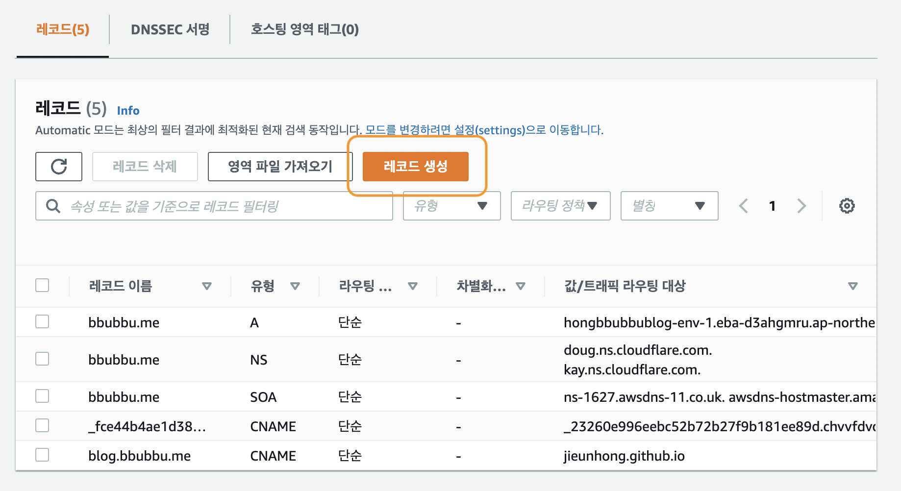
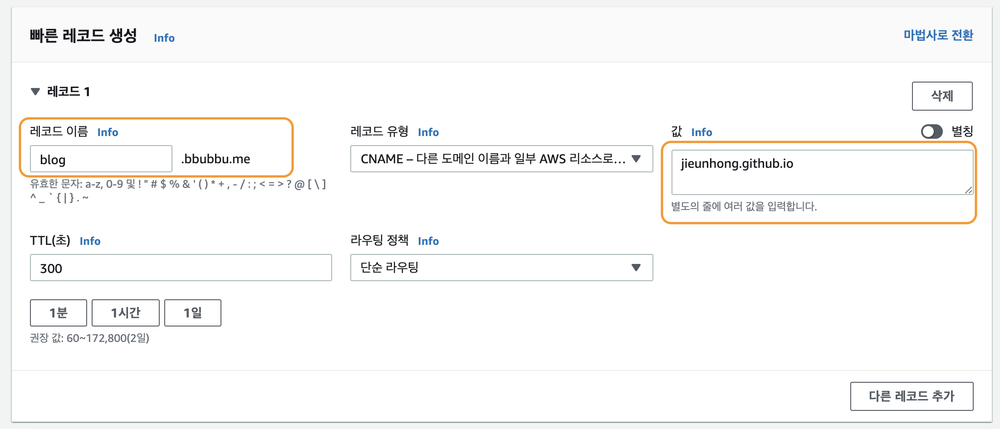
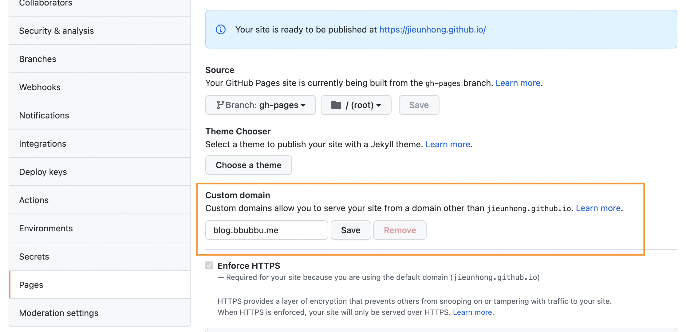
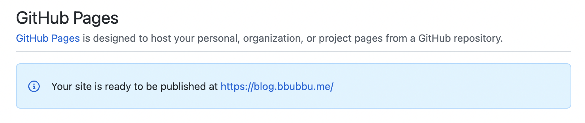
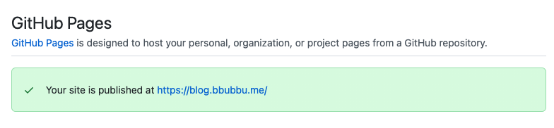

+++++++

**개인 도메인이 있는데! 깃허브 도메인(github.io) 말고 그걸 쓰고싶다!**   
하시는 분들을 위한.. _사실 제가 그랬습니다._
         
저는 기존에 깃허브 블로그와, aws route53에서 관리중인 도메인이 있었습니다.   
그 기준으로 작성합니다.

일단 AWS Route53에 들어가서 원하는 도메인을 선택해주세요.   
그리고 새로운 레코드 생성 버튼을 눌러주세요.
      

저는 서브도메인으로 등록을 했습니다.   
레코드 이름은 각자 알아서 정해주세요. 저는 blog.도메인으로 했습니다.
레코드 유형은 CNAME 이고
값은 본인의 github 블로그 주소를 입력해주세요.
      

레코드 추가를 완료한 뒤에, 깃허브 블로그 프로젝트 설정에서 Pages메뉴에 갑니다.   
Custom domain에 가까 등록한 도메인을 입력하고 save 버튼을 눌러주세요.
      

좀만 기다리면 커스텀 도메인에 등록이 완료되었다는 메세지가 뜹니다!
      

이제 커스텀 도메인에 접근하시면 블로그가 나옵니다.
      

---

* 개인블로그는 의외로 설정이 많네요.. ^*^   
_마크다운 문법을 익히는 중입니다. 생각보다 되게 재미있네요_

---
