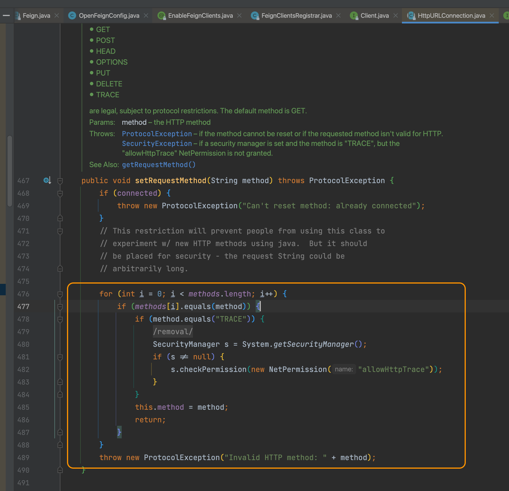
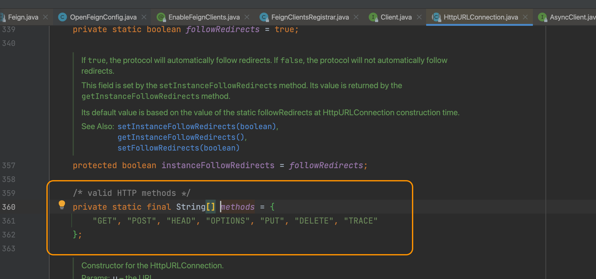
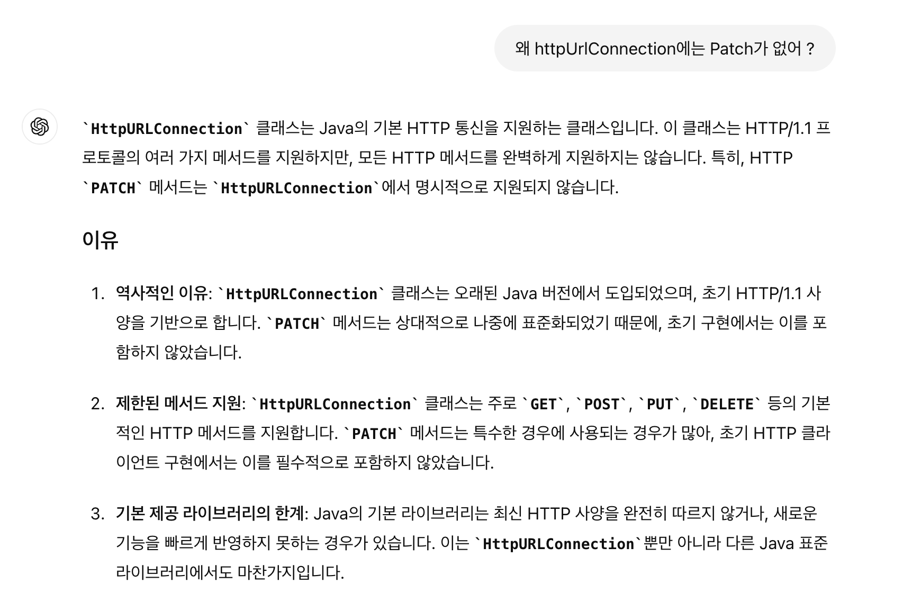
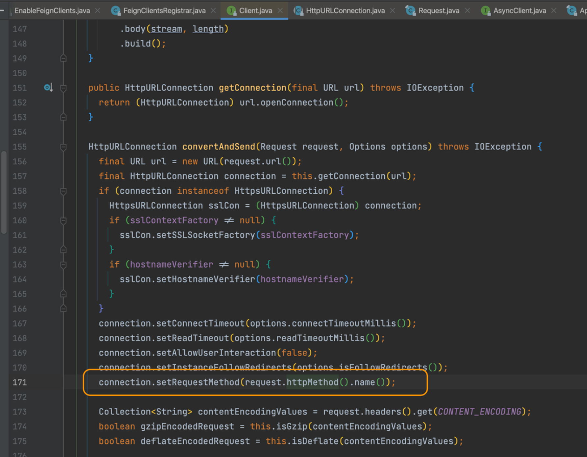
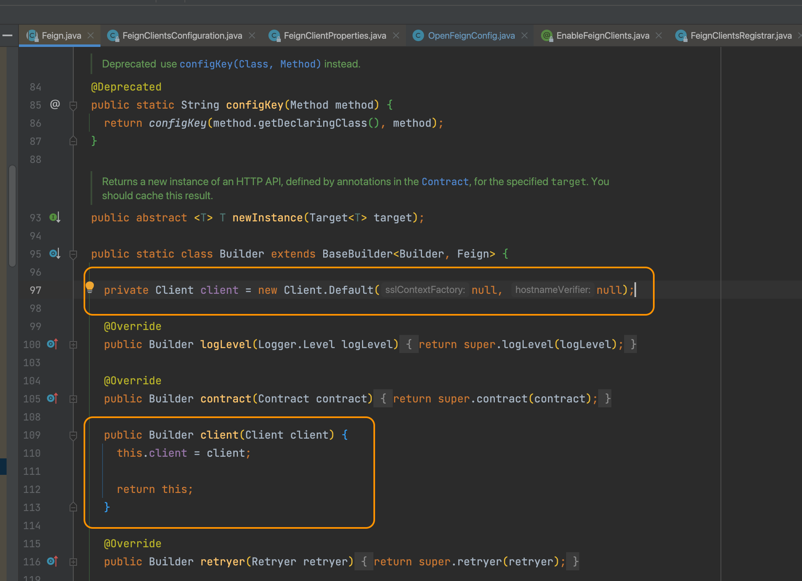
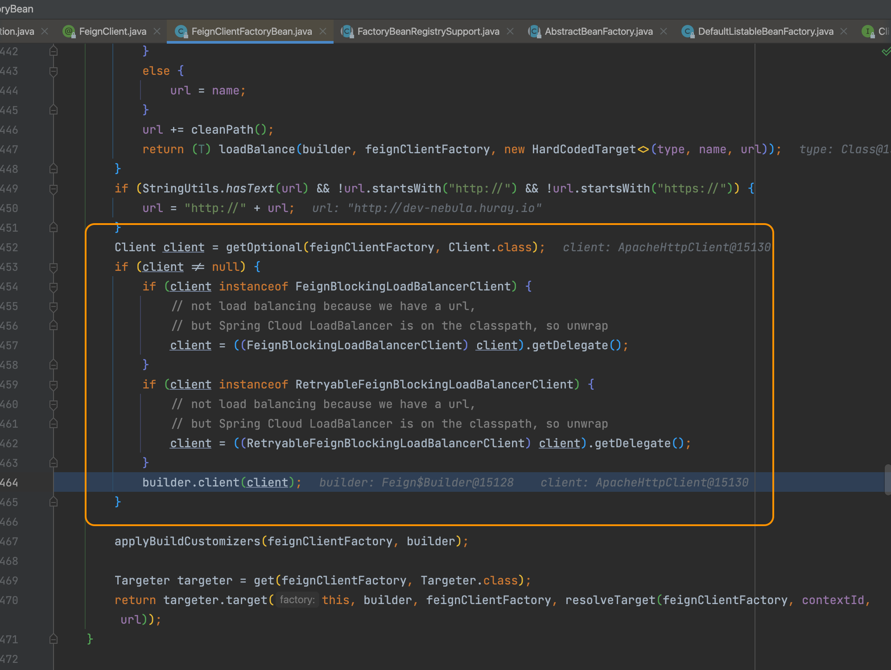
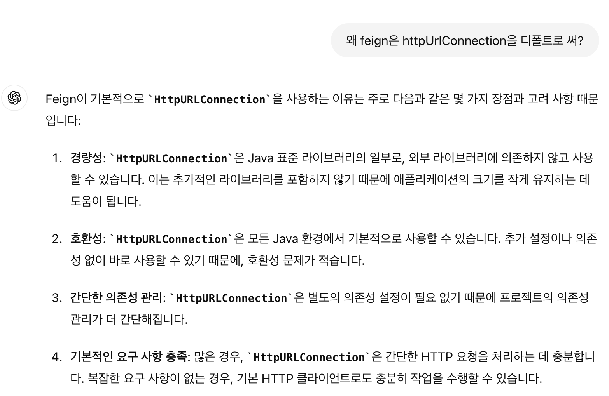
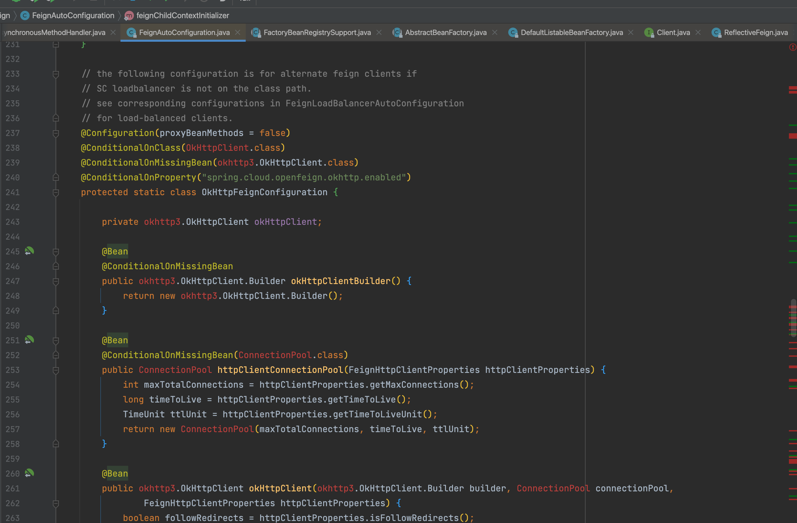
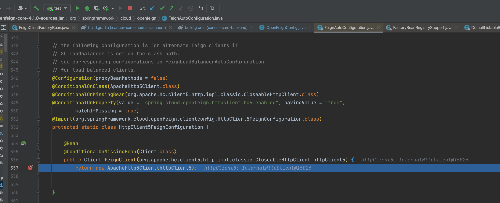

### Feign에서 PATCH method 에러 이유 (Invalid HTTP method: PATCH)

우리 회사에서는 외부 REST API 호출시 대부분 Feign을 이용하고있다.

어느 날, PATCH method API를 호출하니 다음과 같은 에러가 발생하였다. 

### 문제 발생

```java
java.net.ProtocolException: Invalid HTTP method: PATCH
    at java.base/java.net.HttpURLConnection.setRequestMethod(HttpURLConnection.java:489)
    at java.base/sun.net.www.protocol.http.HttpURLConnection.setRequestMethod(HttpURLConnection.java:598)
    at feign.Client$Default.convertAndSend(Client.java:163)
    at feign.Client$Default.execute(Client.java:103)
    at feign.SynchronousMethodHandler.executeAndDecode(SynchronousMethodHandler.java:119)
    at feign.SynchronousMethodHandler.invoke(SynchronousMethodHandler.java:89)
    at feign.ReflectiveFeign$FeignInvocationHandler.invoke(ReflectiveFeign.java:100)
```

오잉?  PATCH 메서드가 유효하지 않은 HTTP method라고?

해당 증상을 인터넷에 검색해보니 `Apache HttpClient`나 `OkHttp` 의존성을 추가하고 해당 `HttpClient`로 빈을 정의해주면 된다고 한다. 

### 해결방법

build.gradle

```java
implementation 'io.github.openfeign:feign-httpclient'
```

```java
@Configuration
public class OpenFeignConfig {
    @Bean
    public Client client() {
        return new ApacheHttpClient();
    }
}
```

증상은 해결되었지만, 원인이 궁금하여 이것저것 찾아보았다. 

1. **왜 PATCH 메서드가 지원이 되지 않을까?**
2. **왜 다른 라이브러리를 빈으로 등록하면(apache, okhttp 등) 잘 동작하는걸까?** 


---

### 문제 원인 찾기

아래 탐구 과정이 너무 길어서 결론을 3줄 요약 해보았습니다.


1. **Feign의 기본 HTTP 클라이언트는 HttpURLConnection 클래스를 사용한다.**
2. **HttpURLConnection은 자바의 기본 라이브러리로, PATCH 메서드를 지원하지 않는다.**
3. **따라서 다른 라이브러리를 이용하여, Client 빈 설정을 해주면 원하는 Client로 동작한다.**
(빈 설정만 해주면 feign이 알아서 끌고감)

먼저 문제가 일어난 부분인 `HttpURLConnection`의 소스를 확인했다. 



489번째 라인에서 에러가 처리된 것을 확인할 수 있었다. 

소스를 간단히 살펴보면 methods 라는 리스트와 요청한 메서드 타입이 동일한지 확인하는 코드로 이루어져 있다.

methods에 어떤 값이 들어있길래 PATCH 메서드를 받지 못하는걸까?



확인해보니 문자열 배열로 선언이 되어있는 상태였다.

뚜둥 … PATCH가 존재하지 않는다! 

왜인지 궁금해서  ChatGPT를 돌려봤다.



**그렇다. Feign에서 사용하는 HttpURLConnection이 너무 초기에 만들어져서 PATCH를 지원하지 않았던 것이었다!**

그럼 우리의 첫 번째 의문이 풀렸다. 

두 번째 궁금증을 해결할 차례이다. 

**왜 다른 라이브러리를 빈으로 등록하면(apache, okhttp 등) 잘 동작하는걸까?** 

분석을 위해 에러코드 중 두 번째 원인 지점으로 가보았다. 



Client라는 클래스에서 `HttpURLConnection`을 이용하고 있는 것을 확인할 수 있었다. 

 Feign 클래스를 확인해보니 기본적으로 Client클래스를 이용하고 있었다. 



아래 사각형을 보면 client를 커스텀하게 변경 가능한 것 처럼 보인다.

아마 이것을 이용해서 다른 라이브러리의 클라이언트로 변경이 가능한가보다. 



**그렇다. 
`FeignClientFactoryBean` 에서 등록된 Client Bean이 있는지 확인하고, 있으면 등록된 client로 변경해주고 있었다.** 

**따라서 `Client`를 Bean으로 등록해두면 Feign이 알아서 찾은 뒤, 사용할 수 있게 개발되어있었다.**

왜 `HttpURLConnection`을 기본으로 쓰나 궁금해서 또 ChatGPT와 담소를 나눠봤다.



여러 이점으로 인해 기본 라이브러리인 `HttpURLConnection` 기본으로 채택 했다는 것을 알 수 있다.

---

### 추가 TMI

feign은 다양한 라이브러리를 유연하게 변경할 수 있도록 설계되었다. 

위에서 제시한 해결방법은 원하는 클라이언트를 빈으로 등록하여 설정되게 하는 방법이었다. 

하지만 직접 빈을 등록하지 않아도되는 방법이 있다. 

open-feign에  `FeignAutoConfiguration`  라는 설정파일이 존재한다. 

해당 파일을 살펴보면 아래와 같이 빨간 줄이 가득한데

코드를 살펴보면 빨간 줄이 그어진 파일이 있는 경우 그리고 설정이 true인 경우 동작하게 되어있다. 



자동 빈 주입을 받아보자. 아래 링크에서 원하는 open-feign용 지원 라이브러리를 가져온다. 

[https://mvnrepository.com/artifact/io.github.openfeign](https://mvnrepository.com/artifact/io.github.openfeign)

난 `apache httpclient5`를 갖고왔다.

okhttp

```java
implementation 'io.github.openfeign:feign-okhttp'
```

apache httpclient5

```java
implementation 'io.github.openfeign:feign-hc5'
```

뭐 알아서 편한걸루 쓰면 된다. 

의존성만 넣어주면? 



짜잔 빈 등록 시점에 자동으로 조건을 충족하여 해당 라이브러리로 빈이 등록된다.
`ConditionalOnProperty` 조건도 따로 명시 안해주면 자동 true 라서 의존성만 주입하면 알아서 적용된다.

(스프링 3.x 버전 기준입니다. 버전마다 open-feign 코드가 다르니 각 버전별 파일 확인해서 적용하시면 됩니다.)

참 잘 만들었다 open-feign ! 

끝 !