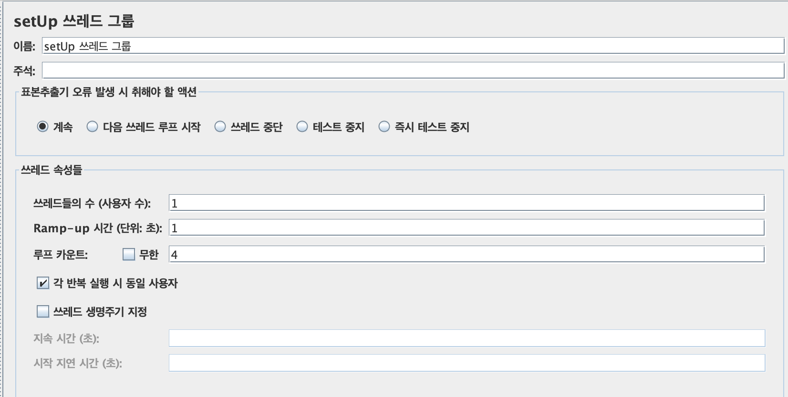
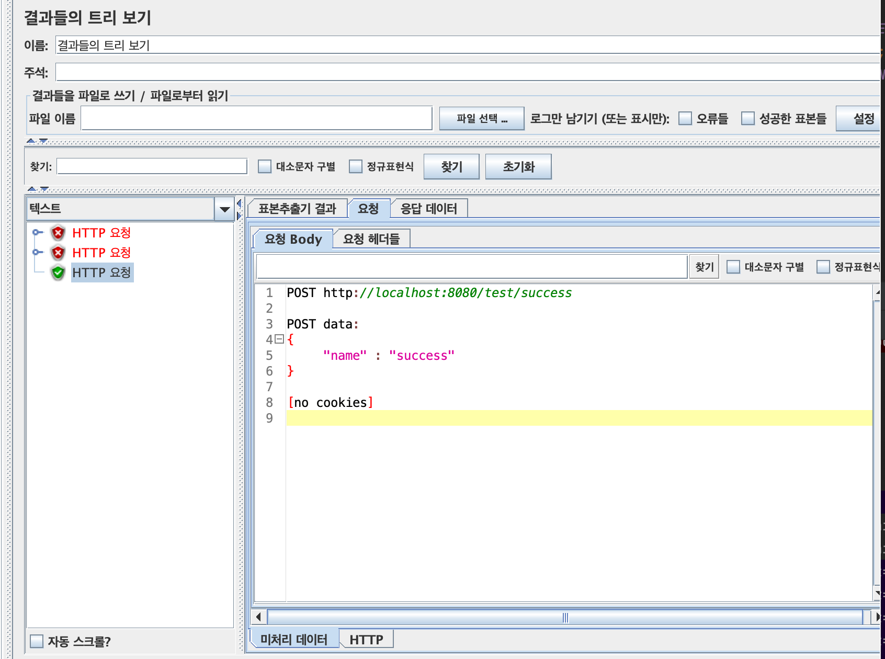

## Jmeter UT 테스트 세팅 +  RequestBody 파일로 주입하기


**`Jmeter를 이번 프로젝트에 적용하게끔 도와준 초루님 감사합니다.`**  

이번 회사 프로젝트에 Jmeter를 도입하기로 했는데, json테스트 데이터를 느릿한 jmeter 어플리케이션에 케이스 별로 하나하나 넣어 주는 작업이 너무 귀찮았고,  
내 컴퓨터가 이상한건지 command+C / command+V 가 앱 상에서 되지 않아 너무 너무 불편하여 파일로 넣을 수는 없는지 찾다가 적용한 글이다.  

**아래는 참고한 글!**  
[Jmeter Tutorial: How to Send a JSON File as Request in Body](https://devqa.io/jmeter-send-json-file-as-request-in-body/)  


**Jmeter다운받는 주소는 아래입니다!**  
[Download Apache JMeter](https://jmeter.apache.org/download_jmeter.cgi)  
꼭 자바 1.8 이상 버전 설치 후에 진행해야 한다.

먼저 테스트용으로 만든 API는 **pathParam과 headerParam, RequestBody**를 받는 POST API이다.  
따라서 우리가 필수적으로 주입해주어야하는 데이터는 이 3개이다.  
  
**`Jmeter에 테스트 데이터 파일을 주입해서 실행할 수 있는데 `**   
**`JSON형태인 RequestBody의 값은 읽어들이지 못해서 따로 주입을 해주어야한다!`** 
```jsx 
@RestController
@RequestMapping("test")
public class TestController {

// highlight-start
    @PostMapping("{pathParam}")
    public String addExecuteSurvey(@RequestHeader("headerParam") String headerParam,
                                                 @PathVariable String pathParam,
                                                 @RequestBody User dto) {

        if (headerParam.equals("error")) throw new ResponseStatusException(HttpStatus.UNAUTHORIZED);
        if (pathParam.equals("error")) throw new ResponseStatusException(HttpStatus.BAD_REQUEST);
        if (dto.getName().equals("error")) throw new ResponseStatusException(HttpStatus.FORBIDDEN);
        return pathParam;
    }
// highlight-end

}
```  

Jmeter가 설치된 폴더로 들어가서 sh파일을 실행시킨다.     
눌러서 실행시켜도 된다..    
하지만 난 sh확장자가 기본으로 코드 에디터가 뜨게 되어있어서 그냥 터미널로 실행시켰다.  
```jsx 
Last login: Tue Jun 14 17:22:05 on ttys000
hongjieun@hongjieunkkeo ~ % cd project/apache-jmeter-5.4.3 
hongjieun@hongjieunkkeo apache-jmeter-5.4.3 % ls
LICENSE		backups		extras		printable_docs
NOTICE		bin		lib		project
README.md	docs		licenses
hongjieun@hongjieunkkeo apache-jmeter-5.4.3 % cd bin
// highlight-start
hongjieun@hongjieunkkeo bin % sh jmeter.sh 
// highlight-end
```    
  
 그럼 휑한 목록을 마주할 수 있다.  
   
   
    
 우리는 한 개의 API를 여러번 테스트해야하기 때문에 **Thread Group**을 생성해야한다.  
   
 
   
 Thread 1개를 여러번 돌리기 위해서는 루프 카운트 항목에 테스팅 할 만큼의 숫자를 적어준다.  
 예시용 데이터에서는 에러 케이스 3개, 성공 케이스 1개로 총 4가지의 항목을 테스팅한다.
     
 
  
 공통으로 사용할 데이터를 만들어준다.  
 **CSV Dataset과 Http Header관리자**를 쓰레드 그룹 안에 추가한다.  
   
   
   
 CSV Dataset은 API에 전달해줄 값들을 세팅하는 부분이다.
   
 **1. CSV파일을 생성해서 파일 이름에 경로를 넣어준다.**    
 **2. 파일에 담긴 데이터 순서대로 변수 이름을 할당해준다.**

 **참고로 JSON과 같은 데이터 형태는 받지 못한다.**  
  
 
   
  **Http Header관리자에는 headerParam 변수를 넘겨주고**    
 requestBody데이터가 json타입으로 갈 예정이기 때문에   
  **content-type : application/json**  
   항목을 추가해준다.
   
   
 각 테스트 항목이 돌 때마다 다른 에러, 성공값이 나올텐데  
 각기 다른 리턴 데이터를 체크해주어야 하기 때문에 **If Controller**를 만들어준다.
   
 
   
이름은 알아서 넣고, 조건에 csv파일에서 받아왔던 Count값을 이용해 체크를 한다.
4개의 열 중에 1번째 열을 테스팅하는 구문이다.
   
 
    
실제로 HTTP 요청을 하기위해 추가해준다.
   
 
  
 서버 주소와 포트번호를 넣고 요청 타입을 POST로 넣어주고 경로에 url 경로를 넣어준다.
 우리는 pathParam을 경로에 받기 때문에 변수를 넣어준다.  
  
 @RequestBody json을 넣어주려면 Body data에 직접 json을 넣어도 되지만  
 나는 귀찮아서 케이스별로 json 내용이 담긴 파일을 생성해서 불러오게 해주었다.  
     
 ```jsx 
${__FileToString(/Users/hongjieun/project/apache-jmeter-5.4.3/project/테스트/case${count}.txt,,)}
```
  
  
예상한 값이 들어왔는지 확인하는 **응답 Assertion을 2개!** 추가한다.  
**Response Code와 Data**를 확인하기 위함이다.  
   
  
Response Code에는 필드를 응답코드로 선택하고 패턴에 예상 응답코드를 적고 equals 로 놓는다.  
에러 테스팅인 경우, 옆에 상태코드 무시를 체크한다.
   
  
   
Response Data에는 필드를 텍스트 코드로 선택하고 응답 데이터를 적는다  
   
  
   
마지막으로 결과를 확인하기 위한 **결과 트리**를 추가해주고 완성된 **if Controller를 복제하여**  
**원하는 테스트 데이터 수 만큼 생성**한다. (각자 예상 response데이터는 수정해주어야한다.)  
   
  
   
완성본
   
  
   
위에 RUN 버튼을 누르면 자동으로 쓰레드가 실행된다.
   
  
   
실제로 마지막에 추가한 결과트리 항목을 눌러보면 요청에 대한 결과 값이 예상한 값과 일치하는지 확인한 내용을 볼 수 있다.   
따로 파일로 만들어준 requestBody를 제대로 불러와서 요청한 것을 확인할 수 있다.  
   
  
   
응답 데이터에서는 어떤 값이 내려왔는지 확인할 수 있다.   
   
    
   
pathParam을 return값으로 넘겨주는 API를 테스팅했기 때문에 result Data는 pathParam으로 내려온다.  
   
    
   
  
  
끝! 

   
---

* Jmeter를 이번 프로젝트에 적용하게끔 도와준 초루님 감사합니다.

---
