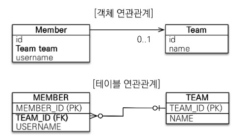
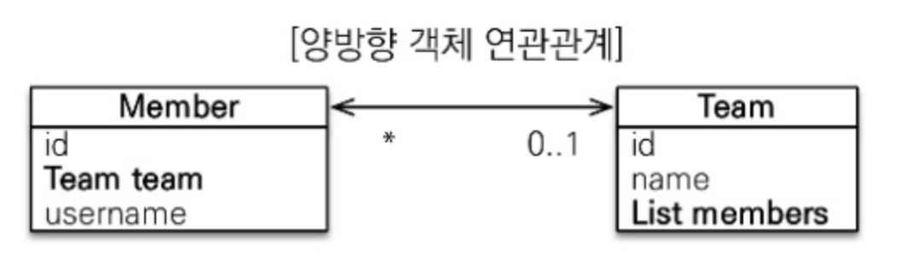
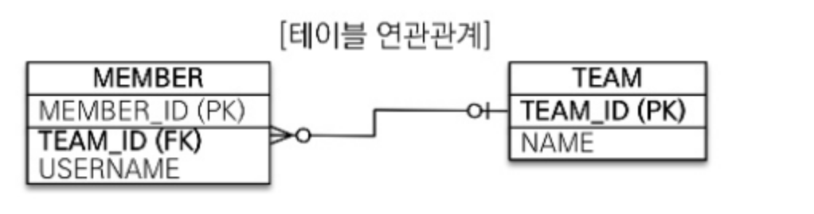
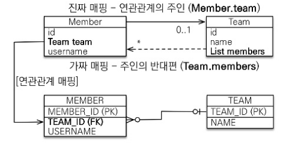

# 5장 연관관계 매핑 기초

객체의 참조와 테이블의 외래 키를 매핑하는 것이 이 장의 목표다.

**방향(Direction)**

- [단방향, 양방향]
- 회원 → 팀 또는 팀 → 회원 처럼 둘 중 한 쪽만 참조하는 것을 단방향 관계라고 한다.
- 회원 <-> 팀 처럼 서로 참조하는 것을 양방향 관계라고 한다.
- 방향은 객체관계에만 존재하고 테이블 관계는 항상 양방향이다.

**다중성(Multiplicity)** 

- [다대일(N:1), 일대다(1:N), 일대일(1:1), 다대다(N:M)]

**연관관계의 주인(Owner)**

- 객체를 양방향 연관관계로 만들면 연관관계의 주인이 있어야 한다.

## 5.1 **단방향 연관관계**

**단방향 연관관계**

다대일(N:1) 단방향 관계

- 회원과 팀이 있다.
- 회원은 하나의 팀에만 소속될 수 있다.
- 회원과 팀은 다대일 관계다.



### 객체 연관관계

- 회원 객체는 Member.team 필드(멤버변수)로 팀 객체와 연관관계를 맺는다.
- 회원과 팀 객체는 **단방향 관계**다. 회원은 Member.team 필드를 통해서 팀을 알 수 있지만 반대로 팀은 회원을 알 수 없다.

### 테이블 연관관계

- 회원 테이블은 TEAM_ID 외래 키로 팀 테이블과 연관관계를 맺는다.
- 회원 테이블과 팀 테이블은 **양방향 관계**다. 회원 테이블의 TEAM_ID 외래 키를 통해서 회원과 팀을 조인할 수 있고 반대로 팀과 회원도 조인할 수 있다.

```sql
SELECT *
FROM MEMBER M
JOIN TEAM T ON M.TEAM_ID = T.ID;
```

```sql
SELECT *
FROM TEAM T
JOIN MEMBER M ON  T.TEAM_ID = M.TEAM_ID;
```

**객체와 테이블의 다른 점**

- 참조를 통한 연관간계는 언제나 단방향이다. 객체간에 연관관계를 양방향으로 만들고 싶**으면 반대쪽에도 필드를 추가해서 참조를 보관해야 한다.**
- 정확히 이야기하면 이것은 **양방향 관계가 아니라 서로 다른 단방향 관계 2개다.**
- 반면에 테이블은 외래 키 하나로 양방향으로 조인할 수 있다.

`객체는 참조(주소)로 연관관계를 맺는다. (a.getB().getC())`

`테이블은 외래키로 연관관계를 맺는다. (A JOIN B AND B JOIN A)` 

### **5.1.1. 순수한 객체 연관관계**

```java
public class Member {
    private String id;
    private String username;

    @Getter
    @Setter
    private Team team; //팀의 참조를 보관
}
@Getter
@Setter
public class Team {
    private String id;
    private String name;
}

Team team1 = new Team("team1", "팀1");

Member member1 = new Member("member1", "회원1");
Member member2 = new Member("member2", "회원2");

member1.setTeam(team);
member2.setTeam(team);

Team findTeam = member1.getTeam();
```

회원1이 속한 팀 1을 조회해보자

```java
Team findTeam = member1.getTeam();
```

이처럼 객체는 참조를 사용해서 연관관계를 탐색할 수 있는데 이것을 **객체 그래프 탐색**이라한다.

### **5.1.2. 테이블 연관관계**

```sql
CREATE TABLE MEMBER (
    MEMBER_ID VARCHAR(255) NOT NULL,
    TEAM_ID VARCHAR(255),
    USERNAME VARCHAR(255),
    PRIMARY KEY (MEMBER_ID)
)
CREATE TABLE TEAM (
    TEAM_ID VARCHAR(255) NOT NULL,
    NAME VARCHAR(255),
    PRIMARY KEY (TEAM_ID)
)
ALTER TABLE MEMBER ADD CONSTRAINT FK_MEMBER_TEAM
    FOREIGN KEY (TEAM_ID) REFERENCES TEAM;
```

이런 테이블 구조에서 member1 이라는 ID를 가진 멤버의 팀을 같이 조회해보자.

```sql
SELECT T.* 
FROM MEMBER M
		JOIN TEAM T ON M.TEAM_ID = T.TEAM_ID
WHERE M.MEMBER_ID = 'member1'
```

이처럼 외래키를 사용해 연관관계를 탐색하는 것을 **조인**이라고 한다.

### **5.1.3. 객체관계 매핑**

JPA 상에서 둘을 매핑해보자

```java
@Entity
@Getter
@Setter
pubilc class Member {
    @Id
    @Column(name = "MEMBER_ID")
    private String id;

    private String username;

    //연관관계 매핑
    @ManyToOne
    @JoinColumn(name = "TEAM_ID")
    private Team team;
}

@Entity
@Getter
@Setter
pubilc class Team {
    @Id
    @Column(name = "TEAM_ID")
    private String id;

    private String name;
}
```

**`객체 연관관계 : [Member.team](http://Member.team) 필드 사용`**

**`테이블 연관관계 : MEMBER.TEAM_ID 외래 키 컬럼 사용`**

### **5.1.4. @JoinColumn**

**@JoinColumn을 생략하면 외래키를 찾을 시 기본 전략을 사용한다.** 

| 속성 | 기능 | 기본값 |
| --- | --- | --- |
| name | 매핑할 외래 키 이름 | 필드명 + _ + 참조하는 테이블의 기본 키 컬럼명 |
| referencedColumnName | 외래 키가 참조하는 대상 테이블의 컬럼명 8장 참조 | 참조하는 테이블의 기본 키 컬럼명 |
| foreignKey(DDL) | 외래 키 제약조건을 직접 지정. 테이블을 생성할 때만 사용 8장 참고 |  |
| unique
nullable
insertable
updatable
columnDefinition
table | @Column 속성과 같음 |  |

### **5.1.5 @ManyToOne**

| 속성 | 기능 | 기본값 |
| --- | --- | --- |
| optional | false로 설정하면 연관된 엔티티가 항상 있어야 한다 | true |
| fetch | 글로벌 페치 전략을 설정한다. 8장 참조 | @ManyToOne=EAGER
@OneToMany=LAZY |
| cascade | 영속성 전이을 사용한다. 8장 참조 |  |
| targetEntity | 연관된 엔티티의 타입 정보를 설정 - 제너릭으로 타입 정보 확인 가능 (거의 사용 X) |  |

## 5.2 연관관계 사용

### **5.2.1. 저장**

```java
//팀1 저장
Team team1 = new Team("team1", "팀1");
em.persist(team1);

//회원1 저장
Member member1 = new Member("member1", "회원1");
member1.setTeam(team);
em.persist(member1);

//회원2 저장
Member member2 = new Member("member2", "회원2");
member2.setTeam(team);
em.persist(member2);
```

! JPA에서 엔티티 저장시 연관된 모든 엔티티는 영속 상태여야 한다.

```java
member2.setTeam(team); // 회원 -> 팀 참조
em.persist(member2); // 저장
```

### **5.2.2. 조회**

1. 객체 그래프 탐색 (객체 연관관계를 사용한 조회)
    
    ```java
    Member member = em.find(Member.class, "member1");
    Team team = member.getTeam(); //객체 그래프 탐색
    ```
    
2. 객체지향 쿼리사용 JPQL
    
    10장에서 알아보자..
    

### **5.2.3. 수정**

```java
//새로운 팀2
Team team2 = new Team("team2", "팀2");
em.persist(team2);

//회원1에 새로운 팀2 설정
Member member1 = em.find(Member.class, "member1");
member1.setTeam(team2);
```

- 3장참조) 수정은 em.update와 같은 메소드가 없다.
- 단순히 엔티티의 값이 변경되면 플러시에서 변경감지 기능이 동작하여 변경사항을 자동으로 DB에 반영한다.

### **5.2.4. 연관관계 제거**

```java
Member member1 = em.find(Member.class, "member1");
member1.setTeam(null); //연관관계 제거
```

### **5.2.5. 연관관계 삭제**

```java
member1.setTeam(null); //회원1 연관관계 제거
member2.setTeam(null); //회원2 연관관계 제거
em.remove(team); //팀 삭제
```

- 연관된 엔티티를 삭제하려면 기존에 있던 연관관계를 먼저 제거하고 삭제해야한다.
- 지키지 않으면 외래키 제약조건으로 인해 오류 발생

## 5.3 양방향 연관관계



여러건과 관계를 맺을 수 있기 때문에 컬렉션 타입을 사용해야한다. 



데이터베이스 테이블은 외래 키 하나로 양방향 조회가 가능하다. 따라서 추가해야할 내용이 없음.

### **5.3.1. 양방향 연관관계 매핑**

```java
@Entity
public class Team {
  //추가되는 부분
  @OneToMany(mappedBy = "team")
  private List<Membmer> members = new ArrayList<>();
}
```

팀과 회원이 일대다 관계이기 때문에 List<Member>타입으로 변수를 추가해주었다.

@OneToMany 매핑정보 추가

@MappedBy 는 양방향 매핑시 사용. 5.4챕터에서 나올 예정

### **5.3.2 일대다 컬렉션 조회**

```java
Team team = em.find(Team.class, "team1");
List<Member> members = team.getMembers(); // 팀 -> 회원
																					// 객체 그래프 탐색
```

## 5.4 연관관계의 주인

**연관관계의 주인**

- 테이블은 외래 키 하나로 두 테이블의 연관관계를 관리한다.
- 엔티티를 단방향으로 매핑하면 참조를 하나만 사용한다.
- 하지만 양방향으로 매핑하게 되면 서로를 참조해야한다.
- = 관리포인트가 2곳으로 늘어난다.
- 엔티티를 양방향 연관관계로 설정하면 참조는 둘, 외래키는 1개이기 때문에 차이가 발생한다.
- 따라서 구 객체 연관관계 중 하나를 정해서 테이블의 외래키를 관리한다.

### **5.4.1. 양방향 매핑의 규칙 : 연관관계의 주인**

연관관계의 주인만이 데이터베이스 연관관계와 매핑되고, 외래키를 관리 (등록, 수정, 삭제) 할 수 있다. 

아닌 쪽은 읽기만 가능하다.

**@Mapped 속성**

- 주인은 MappedBy속성을 사용하지 않는다
- 주인이 아니면 속성의 값의 주인을 지정하여 사용해야 한다.

### **5.4.2. 연관관계의 주인은 외래키가 있는 곳**



- 회원 테이블이 외래 키를 가지고 있으므로 Member.team이 주인
- 주인이 아닌 Team.members에는 mappedBy="team" 속성을 사용해서 주인이 아님을 설정

```java
  @OneToMany(mappedBy = "team")
  private List<Membmer> members = new ArrayList<>();
```

mappedBy 값으로 사용된 team은 연관관계의 주인인 Member.team

데이터베이스 테이블의 다대일, 일대다 관계에서는 항상 다 쪽이 외래키를 가짐.
다 쪽인 @ManyToOne은 항상 연관관계의 주인이 된다. 

**따라서 @ManyToOne에는 mappedBy속성이 없다.**

## 5.5 양방향 연관관계 저장

```java
team.getMembers().add(member1); //무시 : 연관관계의 주인이 아님
team.getMembers().add(member2); //무시 : 연관관계의 주인이 아님
```

```java
member1.setTeam(team1) //연관관계 설정 : 연관관계의 주인
member2.setTeam(team1); //연관관계 설정 : 연관관계의 주인
```

## 5.6 양방향 연관관계의 주의점

양방향 연관관계 설정에서 가장 흔한 실수는 연관관계 주인에게 값을 입력하지 않고, 아닌 곳에만 값을 입력하는 것이다. 

```java
team.getMembers().add(member1); //무시 : 연관관계의 주인이 아님
team.getMembers().add(member2); //무시 : 연관관계의 주인이 아님

em.persist(team)
```

연관관계 주인이 아닌 Team에만 값을 입력했기 때문에 실제 DB에 저장되지 않음.

### **5.6.1. 순수한 객체까지 고려한 양방향 연관관계**

**객체 관점에서 양쪽 방향에 모두 값을 입력해주는 것이 가장 안전하다.**

```java
member1.setTeam(team);
team.getMembers().add(member1); 

em.persist(member1)
```

### **5.6.2. 연관관계 편의 메소드**

```java
public class Member {
    private Team team;

    public void setTeam(Team team) {
        this.team = team;
        team.getMembers().add(this);
    }
}

//연관관계 설정
member1.setTeam(team1);
```

### **5.6.3. 연관관계 편의 메소드 작성시 주의사항**

사실 버그가 있다. 

기존 연관관계를 삭제하지 않았다. 따라서 아래의 코드를 추가해주어야 한다.

```java
public class Member {
    public void setTeam(Team team) {
        //기존 팀과 관계를 제거
        if (this.team != null) {
            this.team.getMembers().remove(this);
        }
        this.team = team;
        team.getMembers().add(this);
    }
}
```

## 5.7 정리

양방향의 장점은 반대방향으로 객체 그래프 탐색 기능이 추가된 것 뿐이다. 

주인의 반대편은 MappedBy로 주인을 지정해야한다.

- 단방향 매핑만으로 테이블과 객체의 연관관계 매핑은 이미 완료되었다.
- 단방향을 양방향으로 만들면 반대방향으로 객체 그래프 탐색 기능이 추가된다.
- 양방향 연관관계를 매핑하려면 객체에서 양쪽 방향을 모두 관리해야 한다.

**`연관관계의 주인은 외래 키의 위치와 관련해서 정해야하지 비즈니스의 중요도로 접근하면 안된다.`**

---

`**양방향 매핑시에는 무한 루프에 조심해야한다.**`

`Member.toString()에서 getTeam()을 호출하고 Team.toString()에서 getMember()을 호출하면 끊임없는 재귀함수가 되어 무한 루프에 빠질 수 있다.` 

---

`다 쪽이 아닌 단 쪽을 연관관계의 주인으로 할 수도 있긴 하다. 다만 성능이나 관리 측면에서 권장하지 않는다. 6장 참고`