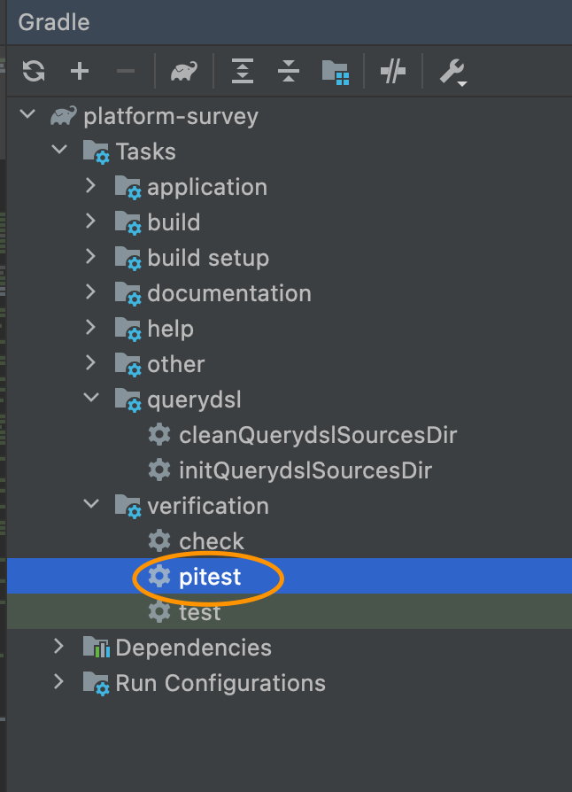
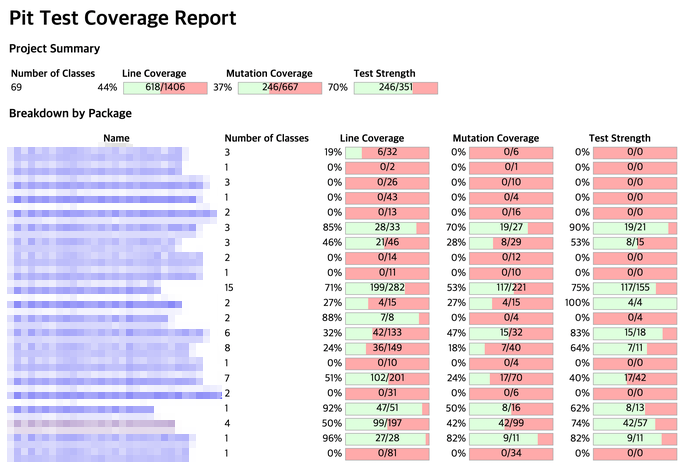
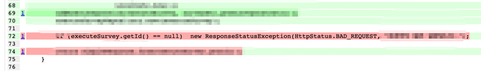
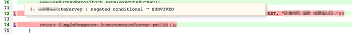

## PIT Mutation Testing 적용 


**`Toss Slash 21 - 테스트 커버리지 100% 영상에서 나온 pitest를 따로 설정해보았습니다.`**    

**아래는 참고한 글!**    
[PitTest 공식 문서](https://pitest.org/)    

자세한 내용은 공식 문서를 참조해주세요.  

 

돌연변이 테스트란, 실제 코드 값을 조금씩 변경했을 때, 테스트 데이터 결과에 문제가 있는지 없는지 검증하는 테스트 기법입니다.  
보통 유효성 검증에 대한 정도를 확인하고, 코드에 신뢰성을 주기 위해 테스트를 실행합니다.  

## Mutation Test의 커버리지 퍼센트가 소스의 신뢰성에 비례하지 않습니다.
 
 정상적인 코드를  
```jsx 
if ( i >= 0 ) {
    return "foo";
} else {
    return "bar";
}
```    
아래처럼 부호를 바꾼다던지, return 값을 바꾸는 등의 조그마난 코드 변경을 한 뒤 실행 했을 때의 결과를 확인합니다.  
```jsx 
if ( i > 0 ) {
    return "foo";
} else {
    return "bar";
}
```    

변경된 코드 테스트가 실패한다면 killed, 성공한다면 lived입니다.  
`코드가 변경 되었는데도 lived인 구문이라면 유효성에 문제가 있을 수도 있으니 확인을 필요로 합니다.`

 

아래 상태값에 대한 설명은 공식문서에 자세하게 나와있습니다.

**If your tests fail then the mutation is killed, if your tests pass then the mutation lived.**  
- **Killed**  
- **Lived**  
- **No coverage**  
- **Non viable**  
- **Timed Out**  
- **Memory error**  
- **Run error**  

Pitest는  이러한 뮤테이션 테스트 기법을 JVM 환경에서 제공해주는 도구입니다.  
저는 gradle로 작업했지만 공식문서에는 다른 도구들도 지원합니다.  

## build.gradle에 추가
```jsx 
plugins {
    id 'info.solidsoft.pitest' version '1.7.4'
}
```    
```jsx 
test {
    systemProperty 'spring.test.constructor.autowire.mode', 'all'
}

pitest {
    jvmArgs = ['-Dspring.test.constructor.autowire.mode=all']
    junit5PluginVersion = '0.15'
}
```     
```jsx 
build.dependsOn 'pitest'
```       
**gradle에 pitest를 눌러서 빌드**   


   
     

## RESULT     
아래 경로에 테스트 페이지가 생성됩니다.  
```jsx 
build/reports/pitest/202206161059/index.html
```           

 
   
gradle에 테스트 범위를 all로 해서 모든 패키지가 검사되었습니다.  

예시 파일에 접근을 하면 아래와 같이 killed된 구문은 초록색 아닌 구문들은 빨간색으로 표시됩니다.  

 

옆에 라인을 hover하면 코드를 어떤 조건으로 변경했을 시에 어떤 결과가 나왔는지 보여줍니다.  


제 경우에는 if(executeSurvey.getId() == null) 부분의 조건을 부정조건을 변경했을때 테스트가 성공해서 빨간 표시가 뜨게 되었습니다.  

 

이런식으로 코드 유효성에 허점이 있는지 확인을 해주는 도구입니다!  

junit테스팅 후에, 한 번씩 돌려서 혹시라도 놓친 부분은 없는지 확인 용으로 활용하면 좋을 것 같네요.  


   
---

* **참고로 엄청 오래 걸립니다. gradle에서 설정 시에 원하는 패키지 범위 설정을 하고 적용하는게 좋을 듯 합니다..**

---
