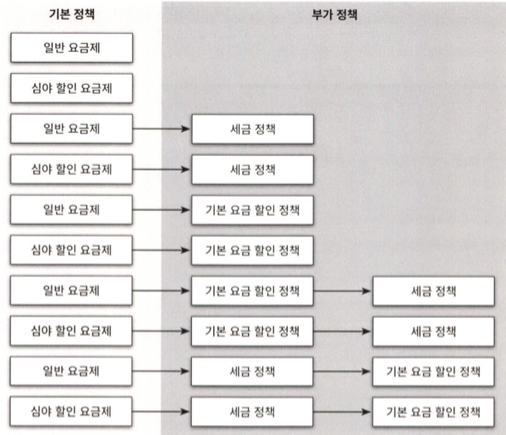
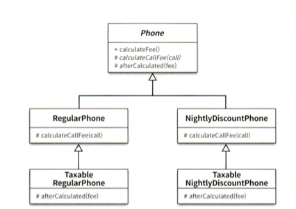
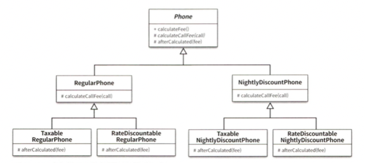
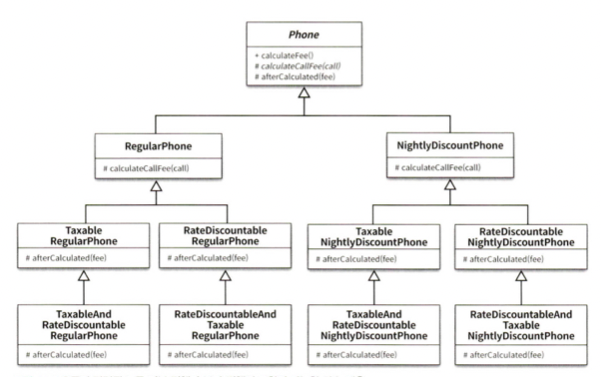
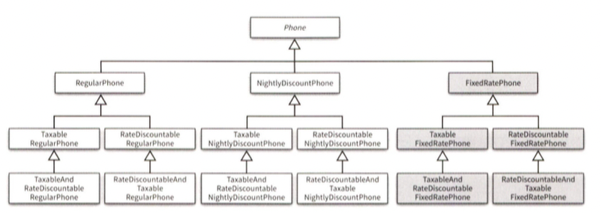
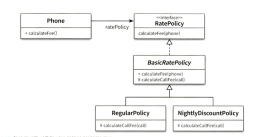
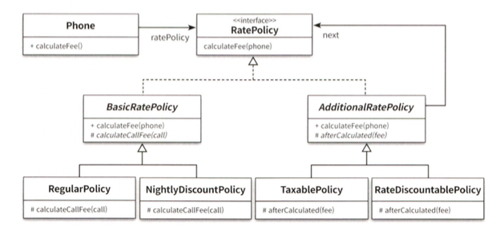
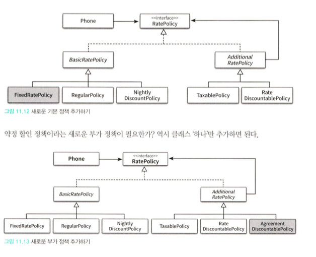
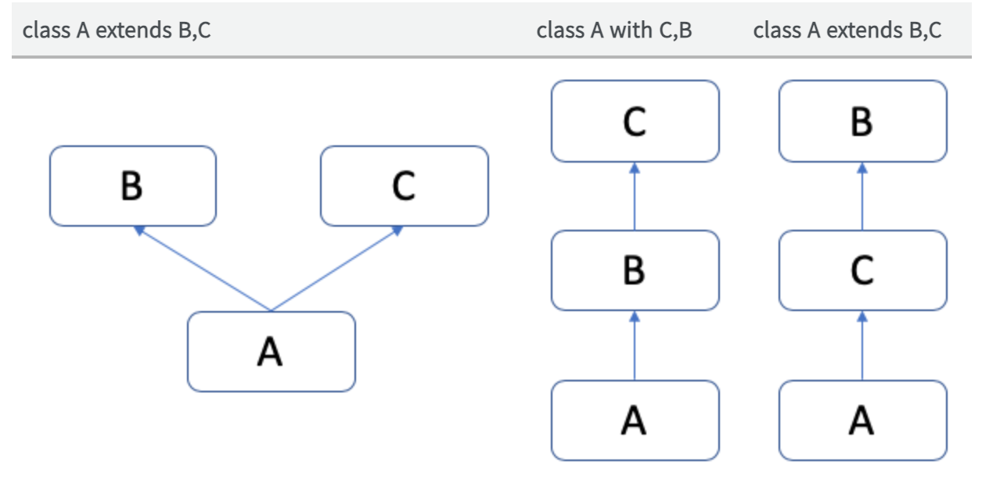

### **합성과 유연한 설계**

| 종류 | 상속 | 합성 |
| --- | --- | --- |
| 명칭 | is-a 관계 | has-a 관계 |
| 역할 | 부모 클래스와 자식클래스를 연결하여 코드 재사용 | 전체를 표현하는 객체를 포함하여 부분 객체의 코드를 재사용 |
| 의존성 | 컴파일 타임에 해결 | 런타임에 해결 |
| 특징 | 부모 클래스의 내부 구현에 대해 상세하게 알아야 하기 때문에 클래스 사이의 결합도가 높아질 수 밖에 없다. (화이트 박스 재사용) | 구현에 의존하지 않고, 퍼블릭 인터페이스에 의존한다. 따라서 포함된 객체의 내부구현이 변경 되더라도 영향이 최소화 되어 안정적 (블랙박스 재사용) |
| 관계 | 정적인 관계 - 코드 작성 시점 이후 변경 불가능 | 동적인 관계 - 실행 시점에 동적으로 변경 가능 |
| 재사용 | 부모 클래스 안의 구현된 코드 (높은 결합도) | 객체의 퍼블릭 인터페이스 (낮은 결합도) |

[코드 재사용을 위해서는] 객체 합성이 클래스 상속보다 더 좋은 방법이다.

### 1. **상속을 합성으로 변경하기**

상속을 남용했을 때 직면할 수 있는 3가지 문제점

- 불필요한 인터페이스 상속 문제
- 메서드 오버라이딩의 오작용 문제
- 부모 클래스와 자식 클래스의 동시 수정 문제

**몽키패치** 

- 현재 실행 중인 환경에만 영향을 미치도록 지역적으로 코드를 수정하거나 확장하는 것.
- 자바에서는 지원하지 않기 때문에 바이트코드를 변환하거나 AOP를 이용해 구현한다.

상속과 비교하여 합성은 안정성과 유연성이라는 장점을 제공한다. 

구현이 아니라 인터페이스에 의존하면 설계가 유연해진다. 

### 2. **상속으로 인한 조합의 폭발적인 증가**

- 하나의 기능을 추가, 수정하기 위해 불필요하게 많은 코드를 추가, 수정해야 한다.
- 단일 상속만 지원하는 언어에서는 상속으로 인해 오히려 중복 코드의 양이 늘어날 수 있다.

**기본 정책과 부가 정책 조합하기**

**요금제에 부가 정책을 추가해보자!**


- 기본 정책의 계산 결과에 적용된다.
- 선택적으로 적용할 수 있다.
- 조합이 가능하다.
- 부가 정책은 임의의 순서로 적용 가능하다.



- 상속을 이용하여 기본 정책 구현하기

일반 요금제에 세금 정책 조합하기

TaxableRegularPhone ← RegularPhone  상속

문제 1. 

부모클래스의 메서드 재사용을 위해  super 호출을 사용하면 원하는 결과를 쉽게 얻을 수 있지만 결합도가 높아진다. 

해결 1. 

결합도를 낮추기 위해 부모클래스에 추상메서드 제공하고 자식이 오버라이딩 하여 결합도를 느슨하게 만들 수 있다.  (구체적 구현이 아닌 필요한 동작의 명세를 기술하는 추상화에 의존)

문제 2. 

부모클래스에 추상메서드를 추가하면 모든 자식 클래스가 추상메서드를 오버라이딩 해줘야 한다. 

모든 추상 메서드의 구현이 동일해짐.

해결 2. 

유연성은 유지하면서도 중복코드를 제거하기 위해서는 기본 구현을 함께 제공한다. 361p



**기본 정책에 기본 요금 할인 정책 조합하기**







기본 정책이 새로 추가 되면 하위 자식 클래스의 수 만큼 중복코드를 생성해야 한다.

이처럼 상속의 남용으로 인해 하나의 기능을 추가하기 위해 필요 이상으로 많은 수의 클래스를 추가해야하는 경우를 **클래스 폭발(Class explosion)  또는 조합의 폭발(Combinational explosion) 문제라고 부른다.**

원인 : 자식 클래스가 부모 클래스의 구현에 강하게 결합되도록 강요하는 상속의 근본적인 한계.

컴파일 타임에 결정된 자식, 부모 클래스 사이의 관계가 변경될 수 없기 때문에 위와 같은 상황에서 자식 클래스와 부모 클래스의 다양한 조합이 필요한 상황에서 유일한 해결 방법은 조합의 수 만큼 새로운 클래스를 추가하는 것.  

이로 인해 새로운 기능 추가 뿐만 아니라 불필요한 중복 코드로 인해 끊임없는 수정과 버그가 발생한다. 

### 3. 합성 관계로 변경하기

클래스 폭발 문제를 해결하기 위해 컴파일타임 관계를 런타임 관계로 변경한다.

합성을 사용하면 퍼블릭 인터페이스에 대해서만 의존하기 때문에 런타임에 객체관계 변경이 가능하다.

런타임 객체 사이의 의존성을 자유롭게 변경할 수 있기 때문에 모든 변수에 따라 클래스를 추가해주어야하는 클래스 폭발과 같은 일이 생기지 않는다. 

합성을 사용하면 구현 시점에 정책 관계를 고정시킬 필요가 없고, 유연하게 변경할 수 있다..

각 요소를 개별 클래스로 구현하고 실행 시점에 필요한 인스턴스를 조립한다.

다만 컴파일 타임 의존성과 런타임 의존성의 거리가 멀면 또 설계의 복잡도가 증가하기 때문에 코드 이해가 어려워 진다. 

설계는 트레이드 오프다. 








요구사항을 변경할 때 오직 하나의 클래스만 수정해도 된다. 

새로운 정책을  추가할 때 오직 관련 클래스 한 개만 생성하면 된다. 

이는 단일 책임 원칙을 준수한다.

**객체 합성이 클래스 상속보다 더 좋은 방법이다**

상속은 부모의 세부 구현에 자식이 강하게 결합되기 때문에 코드의 진화를 방해한다.

구현 상속과 인터페이스 상속

### 4. 믹스인

구체적인 코드를 재사용하면서도 낮은 결합도를 유지할 수 있는 유일한 방법은 재사용에 적합한 추상화를 도입하는 것이다.

믹스인이 상속이 유사한 것 처럼 보이겠지만 사실은 다르다.

상속의 결과로 부모 클래스의 코드를 재사용한다는 사실은 맞지만 상속의 목적은 자식 클래스를 부모 클래스와 동일한 개념적인 범주로 묶어 is-a 관계를 만들기 위한 것이다.

반면 믹스인은 말 그래로 코드를 다른 코드 안에 섞어 넣기 위한 방법이다.

상속이 클래스와 클래스 사이의 관계를 고정시키는 데 비해 믹스인은 유연하게 관계를 재구성 할 수 있다.

믹스인은 코드 재사용에 특화된 방법이면서도 상속과 같은 결합도 문제를 초래하지 않는다.

> 믹스인의 유래믹스인은 Flavors라는 언어에서 처음으로 도입됐고 이후 Flavors의 특징을 흡수한 CLOS(Common Lisp Object System)에 의해 대중화됐다.
> 

## 트레이트(trait)

스칼라 언어에서 제공하는 믹스인 기법이다.

간단하게 설명하면 trait는 **super** 라는 코드가 부모클래스 하나를 고정하지 않는다.

super는 런타임에 달라질 수 있으며 실제로 trait가 믹스인 되는 시점에 결정된다. (실행시점에 결정)

```jsx
trait RateDiscountablePolicy extends BasicRatePolicy {
  val discountAmount: Money
  
  override def calculateFee(phone: Phone): Money = {
    val fee = super.calculateFee(phone)
    fee - discountAmount
  }
}
```

위의 예제에서 super는 BasicRatePolicy의 클래스 어떤 것이든 될 수 있다.

BasicRatePolicy 클래스이든, BasicRatePolicy를 상속한 자식 클래스이든 trait에 대한 코드를 믹스인 할 수 있다.

## **선형화**

믹스인은 믹스인을 구현하는 클래스 위에 놓는다. super class 의 옆이 아니라 위쪽을 쌓아올리기 때문에 여러 클래스를 믹스인을 하여도 모호성이 없다. 하지만 동일한 객체를 믹스인하여도 믹스인 순서에 따라 다른 결과가 나올수 있다.



믹스인

- 객체를 생성할 때 코드 일부를 클래스 안에 섞어 넣어 재사용하는 기법.
- 컴파일 시점이 필요한 코드 조각을 조합하는 재사용 기법이다.
- 상속과는 다르게 코드를 다른 코드 안에 섞어 넣기 위한 방법

믹스인은  상속 계층에서 확장한 클래스보다 더 하위에 위치하게 된다. 

= 대상 클래스의  자식 클래스처럼 사용될 용도로 만들어 지는 것

따라서 믹스인을  **추상 서브클래스**라고 부르기도 한다.

믹스인을 사용하면 특정한 클래스에 대한 변경 또는 확장을 독립적으로 구현한 후 필요한 시점에 차례대로 추가할 수 있다. 따라서 이러한 특징을 **쌓을 수 있는 변경**이라고 부른다.

```jsx
// 믹스인 인터페이스 1
interface LoggingMixin {
    void log(String message);
}

// 믹스인 인터페이스 2
interface AuditingMixin {
    void audit(String action);
}

// 클래스가 LoggingMixin 믹스인을 사용
class LoggableClass implements LoggingMixin {
    @Override
    public void log(String message) {
        System.out.println("로그: " + message);
    }
}

// 클래스가 AuditingMixin 믹스인을 사용
class AuditableClass implements AuditingMixin {
    @Override
    public void audit(String action) {
        System.out.println("감사: " + action);
    }
}

public class Main {
    public static void main(String[] args) {
        LoggableClass loggableObject = new LoggableClass();
        loggableObject.log("이벤트가 발생했습니다.");

        AuditableClass auditableObject = new AuditableClass();
        auditableObject.audit("데이터 삭제");

        // LoggableClass와 AuditableClass는 각각 믹스인의 메서드를 사용할 수 있습니다.
    }
}
```