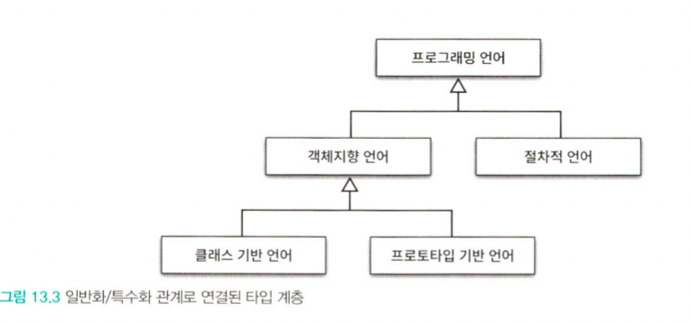
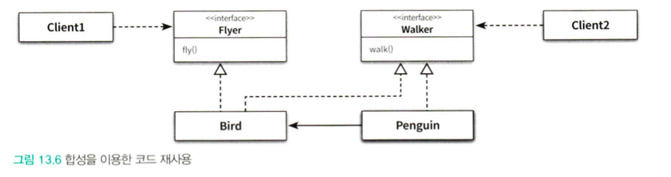

상속의 두 가지 용도

1. 타입 계층을 구현하는 것
    - 부모클래스는 일반적인 개념을 구현하고 (일반화)
    - 자식클래스는 특수한 개념을 구현한다 (특수화)
2. 코드 재사용
    - 부모, 자식 클래스가 강하게 결합되어 변경하기 어려운 코드를 얻게될 수 있음
    
    상속의 목표는 코드 재사용이 아니라 타입 계층을 구현하는 것 이어야 한다.
    
    **객체기반 프로그래밍(Object-Based Programming)** 
    
    - 상태와 행동을 캡슐화한 객체를 조합하여 프로그램을 구성하는 방식
    - 비주얼 베이직
    
    **객체지향 프로그래밍(Object-Oriented-Programming)**
    
    - 객체기반 프로그래밍의 한 종류
    - 상속과 다형성을 지원한다는 점에서 다름
    - 자바, 루비, C#
    
    **프로토타입 기반 언어(Prototype-Based Language)**
    
    - 객체기반 프로그래밍이 다른 의미로 사용될 때가 있음
    - 클래스가 존재하지 않는 프로그래밍 방식
    - 이 때에는 객체기반 프로그래밍이 클래스 없이 객체 만을 사용하는 프로그래밍 방식을 가리킴
    
    ## 1. **타입**
    
    개념 관점의 타입
    
    - 인지하는 세상의 사물의 종류, 인식하는 객체 들에 적용된 개념이나 아이디어
    - 예를 들어, 자바, 루비, 파이썬은 프로그래밍 언어라고 부른다. 이것은 프로그래밍 언어 타입
    - 자바, 루비, 파이썬은 프로그래밍 언어라는 타입에 속하기 때문에 인스턴스 라고 불림( = 객체 )

심볼 - 타입에 이름을 붙인 것 = 프로그래밍 언어

내연 - 타입의 정의, 객체들이 가지는 공통 속성과 행동

외연 - 타입에 속하는 객체들의 집합 = 자바, 루비, 파이썬 등

프로그래밍 언어 관점의 타입

- 연속적인 비트묶음에 의미와 제약을 부여하기 위해 사용
- 목적
    - 타임에 수행될 수 있는 유효한 오퍼레이션의 집합을 정의한다.
        - 자바에서 +는 원시 숫자 또는 문자열 객체는 가능하지만 다른 클래스는 안됨
        - 객체지향 언어들은 객체의 타입에 따라 적용 가능한 연산자의 종류를 제한함으로써 프로그래머의 실수를 막아준다.
    - 타입에 수행되는 오퍼레이션에 대해 미리 약속된 문맥을 제공한다.
        - + 연산의 대상 타입에 따라 정수형은 합친 숫자를 보여주고, 문자열은 문장을 이어줌
        - 부여된 타입에 따라 오퍼레이션이 다름
- 타입은 적용 가능한 오퍼레이션의 종류와 의미를 정의함으로써 코드의 의미를 명확하게 전달하고, 개발자의 실수를 방지한다.

객체지향 패러다임 관점의 타입

- 개념관점에서 타입이란 공통의 특징을 공유하는 대상들의 분류다.
- 프로그래밍 언어 관점에서 타입은 동일한 오퍼레이션을 적용할 수 있는 인스턴스들의 집합이다.

- 객체지향 패러다임 관점에서 오퍼레이션은 객체가 수신할 수 있는 메세지를 의미한다. 따라서 객체의 타입이란 객체가 수신할 수 있는 메세지의 종류를 정의하는 것이다.
- 메세지의 집합 = 퍼블릭 인터페이스
- 결국 객체의 퍼블릭 인터페이스가 객체의 타입을 결정한다. 따라서 동일한 퍼블릭 인터페이스를 제공하는 객체들은 동일한 타입으로 분류된다.

## 2. 타입 계층

타입 사이의 포함관계

- 타입은 외연 관점에서는 더 크고, 내연 관점에서는 더 일반적이다.
- 포함되는 타입은 외연 관점에서는 더 적고 내연 관점에서는 더 특수하다.
- 일반화와 특수화 관계가 존재한다.

슈퍼타입 : 더 일반적인 타입 (부모)

- 집합이 다른 집합의 모든 멤버를 포함한다.
- 타입 정의가 다른 타입보다 좀 더 일반적이다.

서브타입 : 더 특수한 타입 (자식)

- 집합에 포함되는 인스턴스들이 더 큰 집합에 포함된다.
- 타입 정의가 다른 타입보다 좀 더 구체적이다.

객체 정의를 의미하는 내연관점에서 일반화란 어떤 타입의 정의를 좀 더 보편적이고 추상적으로 만드는 과정

특수화란 어떤 타입의 정의를 좀 더 구체적이고 문맥 종속적으로 만드는 과정

집합을 의미하는 외연의 관점에서 일반적인 타입의 인스턴스 집합은 특수한 타입의 인스턴스 집합을 포함하는 슈퍼셋이다. 

반대로 특수한 타입의 인스턴스 집한은 일반적인 타입의 인스턴스 집합에 포함된 서브셋이다. 

따라서 특수한 타입에 속한 인스턴스는 동시에 더 일반적인 타입의 인스턴스 이기도 하다.

일반화 : 다른 타입을 완전히 포함하거나 내포하는 타입을 식별하는 행위 또는 그 행위의 결과

특수화 : 다른 타입에 안에 전체적으로 포함되거나 완전히 내포되는 타입을 식별하는 행위 또는 그 행위의 결과

**객체지향 프로그래밍과 타입계층**

퍼블릭 인터페이스 관점에서 

슈퍼타입 : 서브타입이 정의한 퍼블릭 인터페이스를 일반화시켜 상대적으로 범용적으로 넓은 의미로 정의한 것

서브타입 : 슈퍼타입이 정의한 퍼블릭 인터페이스를 특수화시켜 상대적으로 구체적이고 좁은 의미로 정의한 것

**서브타입의 인스턴스는 슈퍼타입의 인스턴스로 간주될 수 있다.**

## 3. 서브클래싱과 서브타이핑

언제상속을 사용해야 하는가?

- 상속 관계가 is-a 관계를 모델링하는가?
- 클라이언트 입장에서 부모클래스의 타입으로 자식클래스를 사용해도 무방한가?
    - 클라이언트 입장에서는 부모클래스와 자식클래스의 차이점을 몰라야 한다. (행동호환성)

is - a 관계

- 펭귄은 새이지만 날 수는 없다.
- 따라서 어휘적인 정의가 아니라 기대되는 행동에 따라 타입계층을 구성해야 한다.

행동호환성

- 행동이 호환되어야 한다.
- 클라이언트 관점에서 행동의 호환여부를 판단

클라이언트의 기대에 따라 계층 분리하기

인터페이스를 클라이언트의 기대에 따라 분리함으로써 변경에 의해 영향을 제어하는 설계원칙을

**인터페이스 분리 원칙**이라고 부른다

서브클래싱 : 다른 클래스의 코드를 재사용할 목적으로 상속을 사용하는 경우, 구현 상속 또는 클래스 상속이라도 부르기도 함.

서브타이핑 : 타입계층을 구성하기 위해 상속을 사용하는 경우, 인터페이스 상속이라도 부르기도 함 

##