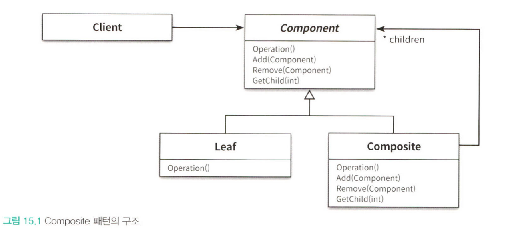

소프트웨어 설계에서 반복적으로 발생하는 문제에 대해 반복적으로 적용할 수 있는 해결방법을 **디자인패턴**  이라고 부른다.

```java
목적 : 설계를 재사용 하는 것. 반복적으로 재사용 할 수 있는 설계의 묶음
```

- 특정한 변경을 일관성 있게 다룰 수 있는 협력 템플릿을 제공

**프레임워크**

- 설계와 코드를 함께 재사용하기 위한 것.
- 일관성있는 협력을 제공하는 확장 가능한 코드

## 1. 디자인 패턴과 설계 재사용

**패턴은 무엇인가?** 

- 반복적으로 발생하는 문제와 해법의 쌍으로 정의된다.
- 패턴을 사용함으로써 이미 알려진 문제와 이에 대한 해법을 문서로 정리 가능, 의사소통 가능
- 추상적인 원칙과 실제 코드 사이의 간극을 메우고, 코드 작성을 도움
- 요점은 패턴이 실무에서 탄생했다는 점.

> 패턴은 하나의 실무 컨텍스트에서 유용하게 사용해 왔고, 다른 실무 컨텍스트에서도 유용할 것이라고 예상되는 아이디어다.
> 

패턴으로 인정하기 위한 조건

- 제 3의 규칙 : 최소 3가지의 서로 다른 시스템에 문제 없이 적용 가능하고 유용한 경우

패턴에서 가장 중요한 요소는 패턴의 이름이다. 

패턴의 집합이 모여 패턴 언어를 구현한다 = 패턴 시스템

### 패턴 분류

- **아키텍쳐 패턴**

디자인 패턴의 상위 개념

소프트웨어의 전체적인 구조를 결정하기 위해 사용할 수 있음

미리 정의된 서브 시스템, 책임을 정의하고 조직화하는 가이드라인을 포함한다.

구체적인 소프트웨어 아키텍쳐 템플릿을 제공하며

프로그래밍 언어와 패러다임에 독립적이다.

- **분석 패턴**

도메인 내의 개념적인 문제를 해결하는데 초점

업무 모델링 시에 발견되는 공통적인 구조를 표현하는 개념들의 집합.

- **디자인 패턴**

특정 정황 내에서 일반적인 설계 문제를 해결한다,

컴포넌트들 사이에서 반복적으로 발생하는 구조를 서술한다.

중간 규모의 패턴으로 특정한 설계 문제를 해결하는 것을 목적으로 한다.

프로그래밍 언어나 프로그래밍 패러다임에 독립적이다.

- **이디엄**

디자인 패턴의 하위에 위치

특정 프로그래밍 언어에 국한된 하위레벨 패턴, 

주어진 언어의 기능을 이용해 컴포넌트 또는 사이의 특정 측면을 구현

예를 들어 C++의 COUNT POINTER

### **패턴과 책임-주도 설계**

객체지향 설계에서 가장 중요한 일은 올바른 책임을 올바른 객체에게 할당하고 객체 간의 유연한 협력 관계를 구축하는 일이다. 

다양한 요소들의 트레이드 오프를 통해 결정된다.

 **1. COMPOSITE 패턴**




### **캡슐화와 디자인 패턴**

1. **STRATEGY 패턴** 

스트래티지 패턴이란, 객체의 행동을 동적으로 바꿀 수 있게 해주는 디자인 패턴 중 하나입니다. 이 패턴을 사용하면 알고리즘을 선택하거나 동적으로 알고리즘을 교체할 수 있는 기능을 객체에 부여할 수 있습니다. 이는 상황에 따라 적절한 알고리즘을 선택하고 실행하는 데 유용하게 사용됩니다.

스트래티지 패턴은 특히 애플리케이션에서 필요에 따라 적절한 알고리즘을 동적으로 선택하고 교체해야 하는 경우에 유용합니다. 이 패턴을 사용하면 알고리즘이나 행동을 캡슐화하여, 애플리케이션의 다른 부분에 영향을 미치지 않고도 특정한 시점에 알고리즘을 변경할 수 있습니다.

이러한 방식으로, 스트래티지 패턴은 프로그래밍에서 유연성을 높이는 데 도움이 됩니다. 이 패턴은 애플리케이션의 특정한 부분만을 변경하면서 전체 애플리케이션 코드를 재사용할 수 있게 하므로, 유지 관리가 필요한 경우나 애플리케이션이 발전하거나 확장해야 할 때 특히 유용합니다.

또한, 스트래티지 패턴은 알고리즘을 사용하는 클라이언트와 알고리즘 자체를 분리함으로써, 알고리즘 변경에 따른 영향을 최소화하고 클라이언트 코드의 안정성을 높이는 데도 도움이 됩니다. 이 패턴을 통해 알고리즘의 구현 세부 사항을 캡슐화하여 클라이언트 코드가 알고리즘의 내부 동작 방식에 의존하지 않도록 할 수 있습니다.


1. **TEMPLATE METHOD 패턴**

TEMPLATE METHOD 패턴은 부모 클래스에서 기본적인 알고리즘의 흐름(즉, "템플릿")을 정의하고, 자식 클래스에서 그 일부 단계를 재정의함으로써 알고리즘의 일부 동작을 변경하게 합니다.

이 패턴은 알고리즘의 구조를 유지하면서 특정 단계를 서브 클래스에서 재정의할 수 있도록 해준다. 이렇게 함으로써 중복 코드를 줄이고, 서브 클래스 간에 공유하는 공통 로직을 한 곳에 모을 수 있다.

TEMPLATE METHOD 패턴은 다음과 같은 상황에서 효과적으로 사용될 수 있다.

- 여러 클래스에서 수행하는 알고리즘이 유사하나 일부 단계는 다를 때. 이런 경우, TEMPLATE METHOD 패턴을 사용하여 알고리즘의 공통 부분을 부모 클래스에서 정의하고, 서브 클래스에서는 차이점을 구현할 수 있다.
- 알고리즘이 변경되어야 할 때. TEMPLATE METHOD 패턴을 사용하면 알고리즘의 일부분을 쉽게 변경하거나 확장할 수 있다.

이러한 방식으로, TEMPLATE METHOD 패턴은 코드의 재사용성을 높이고 유지보수를 용이하게 하며, 더 나아가 코드의 가독성을 향상시킨다.


TEMPLATE METHOD 패턴은 부모 클래스가 알고리즘의 기본 구조를 정의하고 구체적인 단계는 자식이 정의하게 하기 때문에 변경을 캡슐화 할 수 있다. 다만 합성보다는 결합도가 높은 상속을 사용해서 STRATEGY 패턴 처럼 런타임에 객체의 알고리즘을 변경하는 것은 불가능하다. 

1. **DECORATOR 패턴**

DECORATOR 패턴은 객체에 추가적인 요건을 동적으로 첨가하는 방식을 제공합니다. 클래스를 확장하는 것을 통해 기능을 유연하게 확장할 수 있습니다. 이는 객체의 기능을 유연하게 확장하거나 줄이는 것이 가능하게 하며, 이를 통해 객체의 기능을 동적으로 변경할 수 있습니다. 이 패턴은 객체에 추가적인 요건을 동적으로 첨가할 수 있게 하는 장식자 클래스를 포함합니다.

DECORATOR 패턴은 객체에 추가적인 요건을 동적으로 첨가하는 방식을 제공합니다. 이는 '장식자'라고도 불리는 클래스를 이용하여 구현되며, 이 클래스는 기본 객체에 새로운 기능을 추가하거나 기존 기능을 수정하는 역할을 합니다.

이 패턴은 객체지향 프로그래밍에서 클래스의 확장을 통해 기능을 유연하게 확장하거나 줄일 수 있게 하는데 있어서 매우 유용합니다. 즉, 객체의 기능을 동적으로 변경하거나 추가할 수 있게 해주는 장점이 있습니다.

예를 들어, 기본적인 커피에 우유나 시럽 같은 추가적인 토핑을 선택하는 것과 같이, 기본 객체에 다양한 기능을 추가하거나 변경하는 것이 가능합니다. 이런 식으로, 클라이언트는 필요한 기능을 필요한 만큼만 추가하거나 변경할 수 있으며, 이를 통해 객체의 복잡성을 효과적으로 관리할 수 있습니다.

따라서, DECORATOR 패턴은 소프트웨어의 확장성을 증가시키고 코드의 재사용성을 높이는 데 큰 도움이 됩니다.


**패턴은 출발점이다**

패턴은 단지 목표로 하는 설계에 이를 수 있는 방향을 제시하는 나침반에 불과하다. 패턴을 그대로 따르지 목적에 맞게 패턴을 수정하라.

패턴을 맹목적으로 사용하면 문제가 발생한다 = 패턴 만능주의

정당한 이유 없이 사용된 모든 패턴은 설계를 복잡하게 만드는 장애물이다. 

패턴은 복잡성의 가치가 단순성을 넘어설 때만 정당화 돼야 한다.

## 2. **프레임워크와 코드 재사용**

### **코드 재사용 대 설계 재사용**

이상적인 재사용은 코드 재사용과 설계 재사용을 적절한 수준으로 조합하는 것이다. 따라서 코드 재사용만을 위한 컴포넌트 패턴은 틀렸다. 

**프레임워크란** 추상 클래스나 인터페이스를 정의하고 인스턴스 사이의 상호작용을 통해 시스템 전체 또는 일부를 구현해 놓은 재사용 가능한 설계. 를 의미한다. 

프레임워크는 코드를 재사용함으로써 설계 아이디어를 재사용한다. 

### **상위 정책과 하위 정책으로 패키지 분리하기**

프레임워크의 핵심은 추상클래스나 인터페이스 같은 추상화라고 할 수 있다. 그렇다면 어떤 특징이 프레임워크의 재사용성을 향상시키는 것일까? 

- 협력을 일관성있고 유연하게 만들기 위해서는 추상화를 이용해 변경을 캡슐화해야 한다.
- 협력을 구현하는 코드 안의 의존성은 가급적이면 추상클래스 인터페이스같은 추상화를 향하도록 작성해야 한다.

상위정책은 상대적으로 변경에 안정적이지만 세부사항은 자주 변경된다. 

따라서 상위 정책이 자주 변하는 세부 사항에 의존한다면 변경에 대한 파급효과로 인해 상위 정책이 불안정해질 것이다.

이를 위한 가장 좋은 방법은 상위 정책과 세부 사항 모두 추상화에 의존하게 만드는 것이다. 

변하는 것과 변하지 않는 것을 서로 분리하여 별도의 패키지로 분리한다.


중요한 것은 패키지 사이의 **의존성 방향**이다.

의존성 역전 원리에 따라 추상화에만 의존하도록 의존성 방향을 조정하고 추상화를 경계로 패키지를 분리했기 때문에 세부사항을 구현한 패키지는 항상 상위 정책을 구현한 패키지에 의존해야 한다.


상위 패키지는 재사용 가능한 요금 계산 로직을 구현한 프레임워크로 만들 수 있다.

### **제어 역전 원리**

상위 정책을 재사용 한다는 것은 결국 도메인에 존재하는 핵심 개념들 사이의 협력 관계를 재사용하는 것을 의미한다.

의존성 역전 원리에 따라 구축되지 않은 시스템은 협력 흐름을 재사용할 수도 없으며 변경에 유연하게 대처하기 어렵다. 

그러나 의존성을 역전시키면 반대로 프레임워크가 애플리케이션에 속하는 서브클래스의 메서드를 호출한다. 

의존성을 역전시키면 제어 흐름의 주체 역시 역전된다. 이를 제어역전원리 또는 할리우드 원리라고 부른다.

