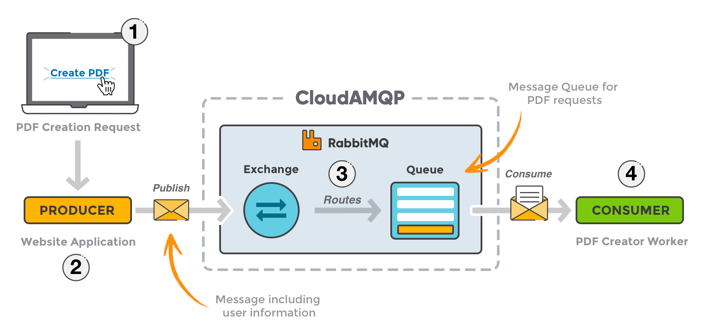
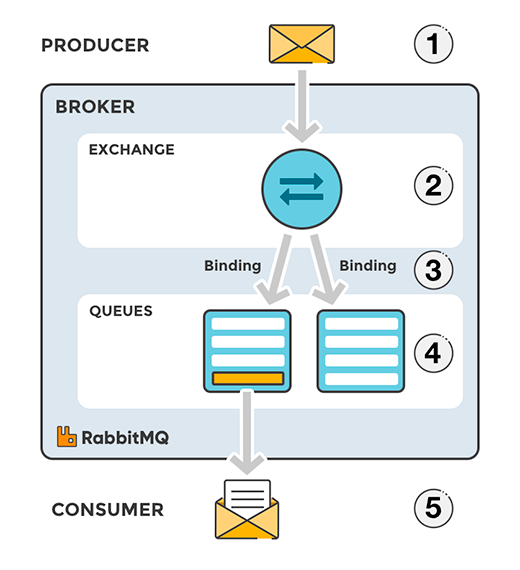
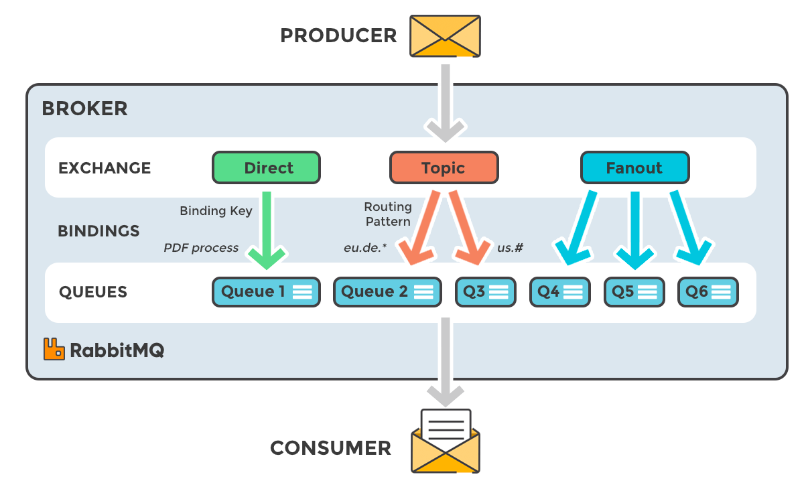
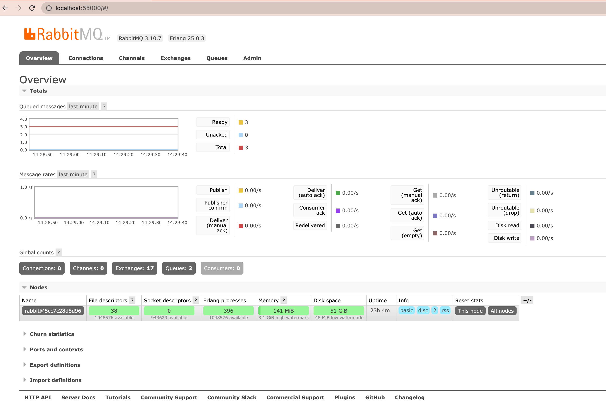

RabbitMQ의 메세지를 받기 위한 AMQP 프로토콜을 구현한 프레임워크인 Spring Cloud Stream을 이용하여 Consumer를 만들기 위함.

## RabbitMQ

### 1. RabbitMQ

메세지 지향 미들웨어를 구현한 메세지 큐잉 시스템 소프트웨어이다.

메세지 브로커라고도 한다.

**MQ를 이용한 프로세스 흐름**

Producer : 메세지를 보내는 사용자

Exchange : 생산자로부터 메시지를 받아서 교환 규칙에 따라 큐에 적재(Route)

Queue : 교환작업이 끝난 후 선별된 메세지를 담은 저장소. 컨슈머에게 전달된다.

Consumer : 메세지를 최종적으로 받는 사용자

### 2. Exchange

프로듀서가 보낸 메세지를 각각의 올바른 목적지에 도달할 수 있도록 교환규칙에 따라 선별 후 큐에 푸시하는 역할을 한다.

**교환 규칙의 종류**

Direct : 바인딩 키와 라우팅 키가 일치해야함

Topic : 바인딩 키와 라운딩 키의 패턴에 속해야함.

Fanout : 규칙 없이 모두 적재

### **3. 실행**

[https://www.rabbitmq.com/getstarted.html](https://www.rabbitmq.com/getstarted.html)

도커로 이미지 띄우는게 아주 편함.

실행하면 대시보드에 접속이 가능하다.

***따로 계정 설정을 하지 않았다면 계정 ID와 PWD는 guest/guest 이다.***

## 관련 문서

- [https://www.rabbitmq.com/](https://www.rabbitmq.com/) - RabbitMQ 공식 사이트
- [https://www.cloudamqp.com/blog/part1-rabbitmq-for-beginners-what-is-rabbitmq.html](https://www.cloudamqp.com/blog/part1-rabbitmq-for-beginners-what-is-rabbitmq.html) - RabbitMQ 가이드 문서