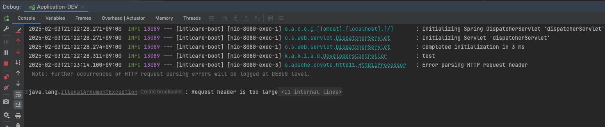
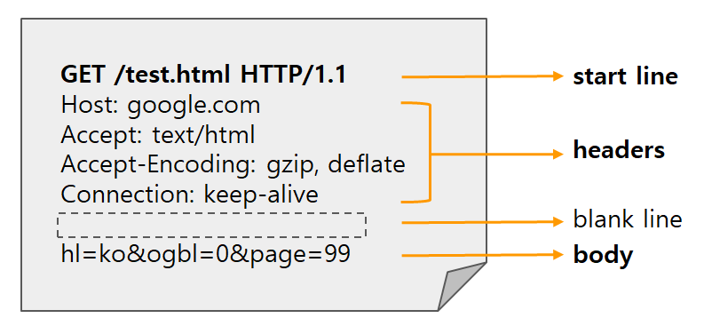
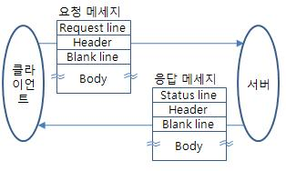
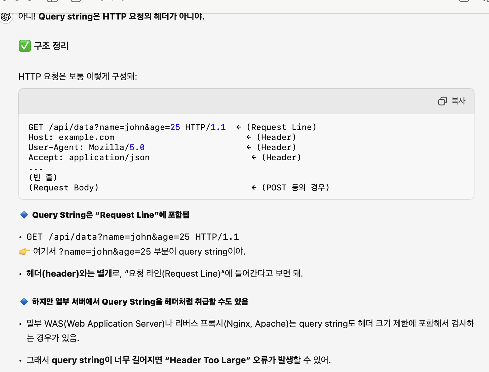
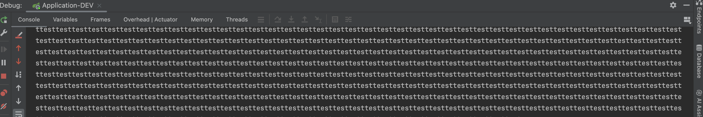

회사 동료 분이 일을 하다가 이상한 이슈를 발견했다.

## header에 값을 길게 넣지도 않았는데 Request header is too large 라는 에러가 뜬다는 것이었다.

심지어 Options 요청에서 에러가 나서 브라우저 콘솔에는 CORS 에러로 나타났다. 

```java
@RestController
@RequiredArgsConstructor
@Slf4j
@Tag(name = "개발 편의용 API")
public class DevelopersController {

    @Operation(summary = "테스트")
    @GetMapping(value = "/api/v1/developers/test")
    public void test(@RequestParam String test) {
        log.info(test);
    }
}
```

예시로 사용할 Rest API를 살펴보자

GET 메서드에 `@RequestParam`으로 문자열을 받아서 log에 출력해주는 APi이다. 

`@RequestParam`은 Spring MVC에서 **HTTP 요청의 Query String 또는 Form 데이터 값을 컨트롤러의 파라미터로 바인딩할 때 사용**하는 어노테이션이다. 

GET 요청에서는 **content-type이 없기 때문에** 데이터를 Query String으로 받아온다.

PUT, POST, PATCH 요청에서 form 데이터를 얻기 위해 Content-type을 아래와 같이 설정했다면, **Request Body에 포함된 Form 데이터로 들어온다.** 

> Content-Type: application/x-www-form-urlencoded
> 

```bash
curl -X 'GET' \
  'http://localhost:8080/api/v1/developers/test?test=testtesttesttesttesttesttesttesttesttest......(중략)........testtesttesttesttesttesttesttesttesttesttesttesttesttesttesttesttesttesttesttesttesttesttesttesttesttesttesttesttesttesttest' \
  -H 'accept: */*'
```

`문제가 되는 API는 GET 메서드이기때문에 RequestParam이 QueryString을 받는 것으로 사용되고 있다. `

curl을 사용하여 terminal에서 요청을 보내보자 (QueryString의 값을 매우 길게 보내야함)

그럼 아래와 같은 에러가 발생한다.



```bash
2025-02-03T21:23:14.100+09:00  INFO 13089 --- [intlcare-boot] [nio-8080-exec-3] o.apache.coyote.http11.Http11Processor   : Error parsing HTTP request header
 Note: further occurrences of HTTP request parsing errors will be logged at DEBUG level.

java.lang.IllegalArgumentException: Request header is too large
```

> **Request header is too large**
> 

Request Header가 너무 길다는 에러가 발생하였다. 

`이상하다 헤더는 -H 'accept: */*' 한 줄만 사용했는데 왜 헤더가 너무 길다고 뜨는 것일까?`


*Header는 변한게 없는데 Too Large라뇨 의사양반..*

어이없어서 HTTP 통신을 다시 찾아봤다.




HTTP 통신 중 요청, 즉 `Request는 크게 4가지의 구성요소`로 이루어져 있다. 

<aside>
💡

> **Request line ( or Start line) :** http method와 요청 url, http 프로토콜 버전으로 이루어진다. 

**Header :** header 정보가 담겨있다.

**Blank line :** 구분하기위한 구분자

**Body(선택값) :** 데이터를 전송하기 위한 공간.
> 
</aside>

알 수 있듯이 queryString은 url에 포함되고, request line이다.

근데 왜 header is too large 인가!! 

chatGPT에게 질문했다. 



**그렇다!** 

**header는 아니지만, 서버에서 url을 헤더 크기 계산에 포함하고, 덕분에 header는 작아도 url이 커서 해당 에러가 날 수 있다고 한다.**

에러를 해결하는 방법은 크게 3가지이다.

1. **쿼리 스트링 크기 줄이기**

   - 간단하다. 그냥 쿼리 스트링에 들어갈 값을 적게 하면 된다.

2. **GET 대신 POST 사용**
    
    ```java
    @RestController
    @RequiredArgsConstructor
    @Slf4j
    @Tag(name = "개발 편의용 API")
    public class DevelopersController {
    
        @Operation(summary = "테스트")
        @PostMapping(value = "/api/v1/developers/test")
        public void test(@RequestBody String test) {
            log.info(test);
        }
    }
    ```
    

   - POST로 변경한 뒤, 변수를 Body에서 받으면 변수의 값이 header의 크기에 영향을 주지 않기 때문에 문제가 발생하지 않는다. 

 

3. **서버의 Header 크기 제한 조정**

```yaml
server.max-http-request-header-size=64KB  # 기본값은 8KB
```

- tomcat(spring boot 내장 웹서버) 설정에서 header size max를 늘리는 방법도 존재한다. 

위 방법들을 적용하면 아래와 같이 정상적으로 동작하는 것을 볼 수 있다. 



개인적인 의견으로는 세 가지 방법 중에 2번 째 방법을 사용하는 것이 가장 좋은 선택이라고 생각한다. *(경우에 따라 정답이 아닐 수도 있음)*

1번의 경우, 임시방법으로 해결하는 것이라 변수의 값이 길어지면 언젠가 또 발생할 수 있기 때문에 해결법이 아니다.

3번의 경우, 모든 http api에 적용되는 설정으로 모든 api의 header 제한이 줄어듬으로써 서버의 자원을 낭비하고, 자원 공격 위험에 노출되어있다. 

또한 queryString에 저렇게 많은 데이터를 보내야 하는 API 라면, GET 메서드가 적합한지 다시 한 번 생각해봐야 한다. 너무 큰 데이터를 url과 header에 노출시키는 것을 항상 조심하고 body에 담아, 데이터 손실이나 공격에 대한 위협에서 보호해야한다.

---

## 참고 사이트

http://www.ktword.co.kr/test/view/view.php?m_temp1=4884&id=902

https://developer.mozilla.org/ko/docs/Web/HTTP/Messages

https://www.baeldung.com/spring-boot-max-http-header-size

https://blog.naver.com/pjt3591oo/223658791971?trackingCode=rss