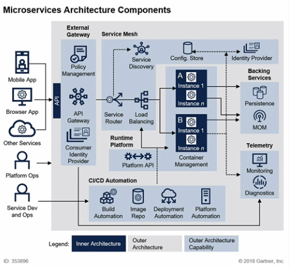

## Spring Cloud로 개발하는 마이크로서비스 애플리케이션(MSA) 스터디 - SESSION 1


**`아래 인프런 강의를 들으면서 학습한 내용을 정리한 포스팅입니다.`**  
[Spring Cloud로 개발하는 마이크로서비스 애플리케이션(MSA)](https://inf.run/Rro2)  
https://inf.run/Rro2


## **Antifragile** 
* Auto scaling
* Microservice : 개별적으로 독립, 서비스를 분리하여 사용
* Chaos engineering : 시스템의 불완전성이나 신뢰성을 높여줌
* Continuous deployments : CI/CD 지속적 통합

## **Cloud Native Architecture**
1. 확장 가능한 아키텍쳐
    * 수평적 확장에 유연, 부하 분산과 가용성 보장
    * 컨테이너 기반 패키지
    * 모니터링 용이
2. 탄력적 아키텍쳐
    * CI/CD 파이프라인을 이용해 배포 시간 단축 
    * 분할 서비스 구조, 종속성 최소화 낭비 방지
    * Discovery cloud
3. 장애 격리
    * 특정 서비스의 오류가 다른 서비스에 영향 X


---

## **Cloud Native Application**
: Cloud Native Architecture로 만들어진 Application  
MicroSerive -> CI/CD -> DevOps(무한반복) -> Containers

CI 지속적 통합 : 젠킨스 등  
CD 지속적 배포 : Continuos (Delivery/Deployment), PipeLine   
카나리 배포와 블루그린 배포

**배포 종류**
1. 롤링 : 서버에 점진적으로 배포
2. 블루 : 한꺼번에 모든 서버에 배포
3. 카나리 : 특정 서버에 배포 후 정상이라면 모두 배포

**DevOps**   
: Development + QA + Operations  
=> 작은 단위로 서비스하여, 고객 요구사항에 빠르게 대응 가능

**Container 가상화**  
: Cloud기반으로 시스템 구축  
Hardware -> Operation -> Container Runtime -> Container


**12Factors**  
: 클라우드 네이티브 어플리케이션 구축시 고려해야할 항목
```
1. 코드 통합 : 1개의 Git/SVN 통해 관리해야함
2. 종속성 배제
3. 환경 외부관리 : 각 용도별 환경 분리
4. 백업 서비스 분리
5. 개발, 테스트, 운영 환경 분리 : CI/CD
6. 상태관리 : 독립성
7. 포트바인딩 : 다른 마이크로 서비스와의 격리
8. 동시성 : 많은 수의 서비스를 복사하여 확장
9. 서비스의 올바른 상태유지 : 각 서비스가 삭제와 종료가 가능한 상태여야함
10. 개발과 운영환경의 통일 : 비슷하게 유지
11. 로그 분리 : 로그 로컬저장 X, 모니터링 도구 사용 가능
12. 관리 프로세스 : 서비스 파악용 관리도구 필요
```
**+**
```
13. API first 
14. Telemetry : 수치화 시각화 도구
15. Authentication and authorizaion : 인증 권한 체크 필수
```
---

## **Microservice**

**개발 방법론**  
Monolithic : 한 개의 커다란 어플리케이션에서 서비스를 모아둠(의존성으로 엮임)  
Microservices : 어플리케이션에 필요한 서비스를 각각 모듈로 만듬(수정 확장 용이)

**Microservice 특징**
1. Challenges
2. Small Well Chosen Deployable Unit
3. Bounded Context
4. RESTful
5. Configuration Management
6. Cloud Enabled
7. Dynamic Scale Up And Scale Down
8. CI/CD
9. Visibility

`기존 개발방식보다 더 많은 시간과 자원이 들어감, 마이크로서비스를 하기 적당한지 고려하여 선택해야함`

**SOA / MSA**

**Service Oriented Architecture**
* 재사용을 통한 비용 절감 (서비스 공유 최대화)
* 공통의 서비스를 ESB에 모아 공통서비스 형식으로 제공

**MicroSerivce Architecture**  
* 서비스 간의 결합도를 낮춰 변화대응 능동적 (서비스 공유 최소화)
* 개별 서비스가 노출된 REST API 사용

+ REST API Level 2이상으로 개발해야함.(3는 HATEOAS 필요)

**MSA표준 구성요소**


---

## **Spring Cloud**
Https://spring.io/projects/spring-cloud

**Centralized configuration management**
* Spring Cloud Config Server  
Location transparency
* Naming Server(Eureka)  
Load Distribution (Load Balancing)
* Ribbon(Client Side)  
* Spring Cloud Gateway
Easier REST Clients  
* FeignClient  
Visibility and monitoring
* Zipkin Distributed Tracing  
* Netflix API gateway  
Fault Tolerance  
* Hystrix  