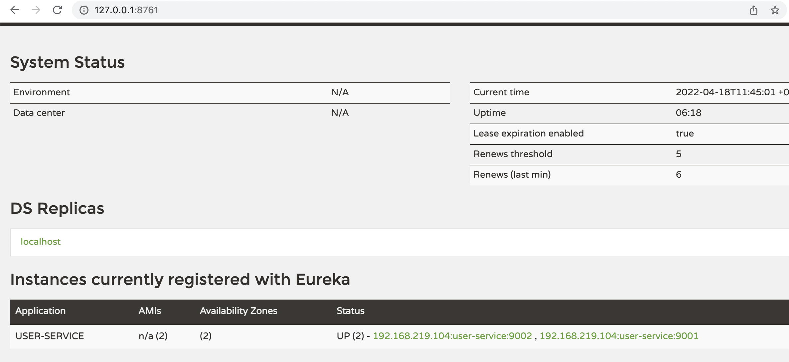

## Spring Cloud로 개발하는 마이크로서비스 애플리케이션(MSA) 스터디 - SESSION 2

**`아래 인프런 강의를 들으면서 학습한 내용을 정리한 포스팅입니다.`**  
[Spring Cloud로 개발하는 마이크로서비스 애플리케이션(MSA)](https://inf.run/Rro2)  

https://inf.run/Rro2


**퀵스텝**

1. [Spring Cloud Netflix Eureka](#spring-cloud-netflix-eureka)  
2. [Eureka Service Discovery](#eureka-service-discovery)
3. [User Service - 프로젝트 생성](#user-service---프로젝트-생성)
4. [User Service - 등록](#user-service---등록)
5. [User Service - Load Balancer](#user-service---load-balancer)


## Spring Cloud Netflix Eureka
**ServiceDiscovery**

`등록 -> API 게이트웨이에 전송 -> ServiceDiscovery -> 각 Server`

전송된 요청정보에 따라서 서비스를 판별하고 전달해주는 역할


 

 ---

**Server Application Dependencies**
* Eureka Server

**Client Application Dependencies**
* Eureka Discovery Client
* Spring web
* Spring Boot DevTools
* Lombok


## Eureka Service Discovery
```jsx 
@SpringBootApplication
// highlight-start
@EnableEurekaServer
// highlight-end
public class DiscoveryserviceApplication {

    public static void main(String[] args) {
        SpringApplication.run(DiscoveryserviceApplication.class, args);
    }

}
```
**@EnableEurekaServer**  
-> 현재 스프링부트 프로젝트에 유레카서버용 ServiceDiscovery라는 것을 등록해줌


```jsx 
server:
  port: 8761

spring:
  application:
    name: discoveryservice

eureka:
  client:
// highlight-start
    register-with-eureka: false
    fetch-registry: false
    #자체로 서버를 띄우는 것이기 때문에 등록이 필요치 않음.
// highlight-end
```


## User Service - 프로젝트 생성
```jsx 
@SpringBootApplication
// highlight-start
@EnableDiscoveryClient
// highlight-end
public class UserServiceApplication {

    public static void main(String[] args) {
        SpringApplication.run(UserServiceApplication.class, args);
    }

}
```
**@EnableDiscoveryClient** 
-> 현재 어플리케이션이 Service Discovery라고 등록해주는 어노테이션


## User Service - 프로젝트 등록 
```jsx 
server:
// highlight-start
  port: 9001
// highlight-end

spring:
  application:
    name: user-service

eureka:
  client:
// highlight-start
    register-with-eureka: true
    fetch-registry: true
    #서버에 등록을 하는 클라이언트이기 때문에 true
    service-url:
      defaultZone: http://127.0.0.1:8761/eureka
      #등록할 서버 주소 등록

// highlight-end
```
똑같은 클라이언트 어플리케이션을 포트를 다르게 해서 2개를 동시에 띄웠을 때, 유레카 대시보드에서 띄워주는 정보


3. 따로 어플리케이션 파일 만들어서 실행시키기


## User Service - Load Balancer 

랜덤포트로 띄워주기


HOST IP address application-name port번호를 조합하여 유니크한 이름 만들

```jsx 
server:
// highlight-start
  port: 0
      #매번 실행시에 포트를 다르게 넣어줌 (random)
// highlight-end

spring:
  application:
    name: user-service

eureka:
  instance:
// highlight-start
    instance-id: ${spring.cloud.client.hostname}:${spring.application.instance_id:${random.value}}
    #server.port = 0이면 실제 포트는 다르게 들어가지만, Eureka Server에서 인스턴스 명이 port 가 0번으로 중복되어 1개로 표시해주기 때문에 아이디를 랜덤으로 지정해줌
// highlight-end
  client:
// highlight-start
    register-with-eureka: true
    fetch-registry: true
    #서버에 등록을 하는 클라이언트이기 때문에 true
    service-url:
      defaultZone: http://127.0.0.1:8761/eureka
      #등록할 서버 주소 등록

// highlight-end
```
```jsx 
${spring.cloud.client.hostname}:${spring.application.instance_id:${random.value}}
```

클라이언트 주소를 누르면, actuator관련 코드가 없어 404는 나지만 정상작동.

