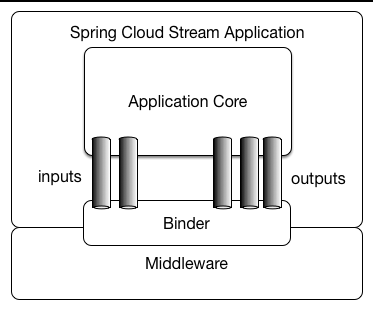
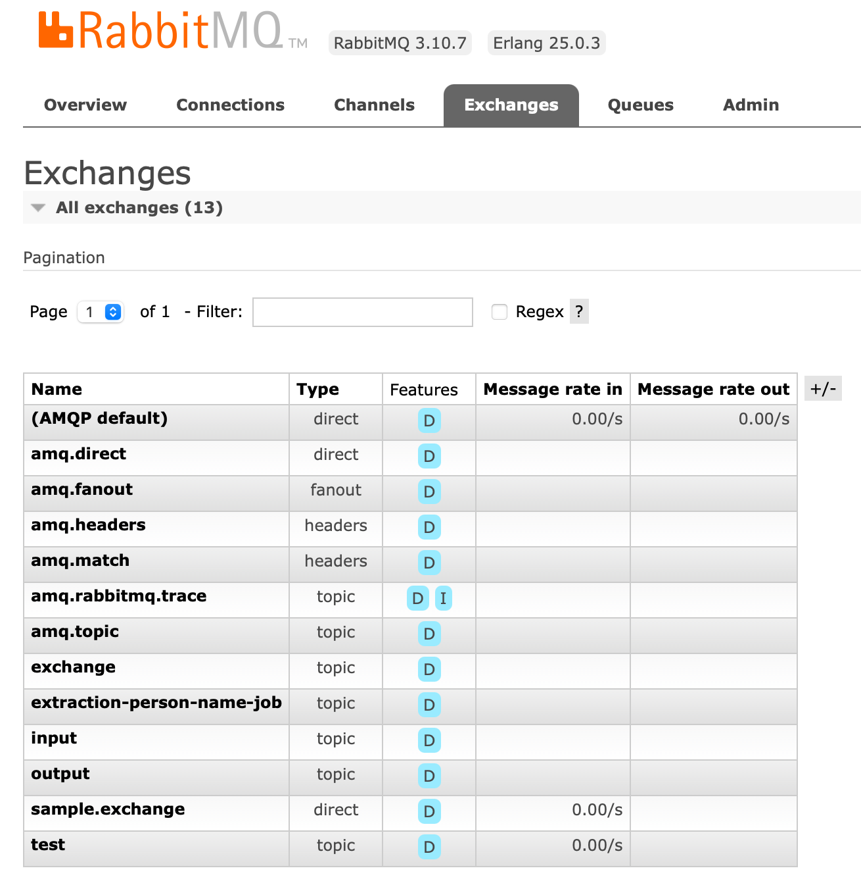

RabbitMQ의 메세지를 받기 위한 AMQP 프로토콜을 구현한 프레임워크인 Spring Cloud Stream을 이용하여 Consumer를 만들기 위함.

## Spring Cloud Stream

### 1. Spring Cloud Stream

Spring Cloud 진영에서 메세지 통신을 위해 구축된 프레임워크.

이벤트 기반(event-driven) 마이크로 서비스를 구축하기 위해 탄생되었음.

Spring Cloud Stream은 [Kafka](https://github.com/spring-cloud/spring-cloud-stream-binder-kafka) 및 [Rabbit MQ](https://github.com/spring-cloud/spring-cloud-stream-binder-rabbit) 용 바인더 구현을 제공한다.

다만 세세한 MQ 설정은 Spring Cloud Stream이 아닌 개별 AMPQ을 구현하는 것이 좋다. (세부 설정 힘듬)



Spring Cloud Stream 애플리케이션은 미들웨어 중립적 코어로 구성된다.

애플리케이션은 브로커에 의해 노출된 대상과 바인딩 을 설정하여 통신한다.

바인딩을 설정하는 데 필요한 브로커별 세부 정보는 미들웨어별 바인더 구현에서 처리한다.

Binder가 MQ 브로커를 의미하는데 Spring Cloud Stream은 다양한 MQ를 지원한다.

- [RabbitMQ](https://github.com/spring-cloud/spring-cloud-stream-binder-rabbit)
- [Apache Kafka](https://github.com/spring-cloud/spring-cloud-stream-binder-kafka)
- [Kafka Streams](https://github.com/spring-cloud/spring-cloud-stream-binder-kafka/tree/master/spring-cloud-stream-binder-kafka-streams)
- [Amazon Kinesis](https://github.com/spring-cloud/spring-cloud-stream-binder-aws-kinesis)
- [Google PubSub (partner maintained)](https://github.com/spring-cloud/spring-cloud-gcp/tree/master/spring-cloud-gcp-pubsub-stream-binder)
- [Solace PubSub+ (partner maintained)](https://github.com/SolaceProducts/spring-cloud-stream-binder-solace)
- [Azure Event Hubs (partner maintained)](https://github.com/Azure/azure-sdk-for-java/tree/main/sdk/spring/spring-cloud-azure-stream-binder-eventhubs)
- [Azure Service Bus (partner maintained)](https://github.com/Azure/azure-sdk-for-java/tree/main/sdk/spring/spring-cloud-azure-stream-binder-servicebus)
- [AWS SQS (partner maintained)](https://github.com/idealo/spring-cloud-stream-binder-sqs)
- [AWS SNS (partner maintained)](https://github.com/idealo/spring-cloud-stream-binder-sns)
- [Apache RocketMQ (partner maintained)](https://github.com/alibaba/spring-cloud-alibaba/wiki/RocketMQ-en)

### 2. 사용방법

사용방법은 크게 2가지가 있다.

1. Annotation Based Programming Model
2. Funtional Programming Model

이 중 1번째인 Annotation기반은 spring-cloud-stream 모듈과 spring-cloud-stream-reactive 모듈이 합쳐짐으로 인해 더 이상 사용하지 않고, functional을 권장하고 있다.

따라서 이 문서에서는 1번 방법을 따로 서술하지 않습니다.

### [주목할만한 지원 중단](https://docs.spring.io/spring-cloud-stream/docs/current/reference/html/spring-cloud-stream.html#spring-cloud-stream-preface-notable-deprecations)

- Annotation 기반 프로그래밍 모델. 기본적으로 @EnableBInding, @StreamListener 및 모든 관련 Annotation은 이제 Funtional 프로그래밍 모델을 위해 @deprecated 되어있습니다. 자세한 내용은 [Spring Cloud Function 지원](https://docs.spring.io/spring-cloud-stream/docs/current/reference/html/spring-cloud-stream.html#spring_cloud_function) 을 참조하세요.
- *반응 모듈* ( spring-cloud-stream-reactive)은 중단되었으며 spring-cloud-function을 통한 기본 지원을 위해 더 이상 배포되지 않습니다. 이전 버전과의 호환성을 위해 여전히 spring-cloud-stream-reactive이전 버전에서 가져올 수 있습니다.
- spring-cloud-stream-test-support새 테스트 바인더를 위해 MessageCollector로 *지원 바인더 를 테스트합니다.* 자세한 내용은 [테스트](https://docs.spring.io/spring-cloud-stream/docs/current/reference/html/spring-cloud-stream.html#_testing) 를 참조하세요.
- *@StreamMessageConverter* - 더 이상 필요하지 않으므로 더 이상 사용되지 않습니다.
- 헤더 참조 는 original-content-typev2.0에서 더 이상 사용되지 않는 후 제거되었습니다.
- 속성 을 제공하는 경우 더 BinderAwareChannelResolver이상 사용되지 않습니다 . spring.cloud.stream.sendto.destination이것은 주로 함수 기반 프로그래밍 모델을 위한 것입니다. StreamListener의 경우 여전히 필요하므로 StreamListener 및 주석 기반 프로그래밍 모델을 더 이상 사용하지 않고 중단할 때까지 유지됩니다.

크게 메세지를 보내는 Producer와 받는 Consumer 2개의 프로젝트가 필요합니다.

---

# **Producer**

**build.gradle**

```jsx
dependencies {
    implementation 'org.springframework.boot:spring-boot-starter'
    implementation 'org.springframework.boot:spring-boot-starter-web'
    testImplementation 'org.springframework.boot:spring-boot-starter-test'

    annotationProcessor 'org.projectlombok:lombok'
    compileOnly 'org.projectlombok:lombok'

    implementation 'org.springframework.cloud:spring-cloud-starter-stream-rabbit:3.2.4'
    implementation 'com.fasterxml.jackson.datatype:jackson-datatype-jsr310:2.13.3'
}
```

Rest API로 Producer를 실행시키기 위해 spring-boot-starter-web,

Spring Cloud Stream RabbitMQ를 위해 spring-cloud-starter-stream-rabbit 이 필요하다.

**application.yml**

```nasm
spring:
  cloud:
    function:
      definition: direct
    stream:
      bindings:
        direct-out-0:
          binder: rabbit
          destination: test
      binders:
        rabbit:
          type: rabbit
          environment:
            spring:
              rabbitmq:
                host: 127.0.0.1
                port: 55001
                username: guest
                password: guest

  rabbitmq:
    host: 127.0.0.1
    port: 55001
    username: guest
    password: guest
server:
  port: 8080
```

Spring Cloud Stream의 바인딩 네이밍 규칙은  아래와 같다.

**Producer인 경우  [bindingName]-out-[숫자 (0부터 시작) ]**

**Consumer인 경우 [bindingName]-in-[숫자 (0부터 시작) ]**

Spring Cloud Stream 에서는 함수를 Bean에 등록시켜주면 bindingName과 일치하는 빈을 찾아서 연결해준다.

숫자의 경우 MultiBinder 지원을 위해 존재한다.

*카프카와 RabbitMQ를 동시에 쓸 경우, 아래와 같이 명명한다.*

direct-out-0 | direct-out-1

**binder에는 사용할 Binder의 종류와 설정 정보를 명시해주면 된다.**

현재 RabbitMQ를 바인더로 쓸 예정이기 때문에 관련 정보를 넣어두었다.

참고로 **destination**은 RabbitMQ에서 **exchange**와 동일한 의미를 지닌다.

실제로 코드를 실행시키면 RabbitMQ 대시보드에서 확인할 수 있다.



**SampleMessage.java**

```
@Data
@NoArgsConstructor
@AllArgsConstructor
@Builder
public class SampleMessage implements Serializable {
    private String message;
}
```

간단한 문자열 변수가 담긴 객체를 생성한다.

**ProducerConfig.java**

```
@Configuration
@Slf4j
public class ProducerConfig {

    @Bean
    public Sinks.Many<Message<SampleMessage>> many() {
        return Sinks.many().unicast().onBackpressureBuffer();
    }

    @Bean
    public Supplier<Flux<Message<SampleMessage>>> direct(Sinks.Many<Message<SampleMessage>> many) {
        return () -> many.asFlux()
                .doOnNext(m -> log.info("Manually sending message {}", m))
                .doOnError(t -> log.error("Error encountered", t));
    }

}
```

Producer 관련 설정을 정의한다.

**아까 BindingName을 direct 라고 정의해줬기 때문에  Supplier함수명을 direct로 맞춰주었다.**

**Bean Name 에 direct라고 명시해도 된다.**

**MessageController.java**

```java
@RestController
@Slf4j
public class MessageController {

    @Autowired
    private Sinks.Many<Message<SampleMessage>> many;

    @GetMapping(value = "/direct/{message}")
    public Mono<Void> directMessage(@PathVariable String message) throws IOException {
        return Mono.just(message)
                .doOnNext(m -> {
                    SampleMessage myMessage = SampleMessage.builder().message(m).build();
                    many.emitNext(
                            MessageBuilder.withPayload(myMessage)
                                    .setHeader(MessageHeaders.CONTENT_TYPE, MimeTypeUtils.APPLICATION_JSON)
                                    .build(),
                            Sinks.EmitFailureHandler.FAIL_FAST
                    );
                })
                .doOnNext(m -> log.info("send {}", m))
                .then();
    }
}
```

실제로  API가 호출되는 시점에 메세지를 보내는 로직이다.

현업 프로젝트에서 Header에 데이터가 담길 수도 있을 것 같아 Message객체 안에 SampleMassage를 넣어서 보내주고 있다.

이렇게 간단하게 끝이다.

---

# Consumer

**build.gradle**

```jsx
dependencies {
    // spring cloud stream
    implementation 'org.springframework.cloud:spring-cloud-starter-stream-rabbit:3.2.4'
    // RabbitMQ serialization
    implementation 'com.fasterxml.jackson.datatype:jackson-datatype-jsr310:2.13.3'
}
```

Spring Batch가 구현되어있는 Repository에 이식할 예정이라 기존 gradle에 2가지만 추가했다.

application.yml

```yaml
spring:
  cloud:
    function:
      definition: direct
    stream:
      bindings:
        direct-in-0:
          binder: rabbit
          destination: test
      binders:
        rabbit:
          type: rabbit
          environment:
            spring:
              rabbitmq:
                host: 127.0.0.1
                port: 55001
                username: guest
                password: guest

  # RabbitMQ config
  rabbitmq:
    host: 127.0.0.1
    port: 55001
    username: guest
    password: guest

server:
  port: 8081
```

Producer 설정과 동일하다. 다만 BindingName 중간 in이 out으로 변환되었다.

**SpringBatchExampleApplication.java**

```java
@Slf4j
@SpringBootApplication
public class SpringBatchExampleApplication {

    public static void main(String[] args) {
        SpringApplication.run(SpringBatchExampleApplication.class, args);
    }

    @Autowired
    private JobLauncher jobLauncher;

    @Autowired
    private Job extractionPersonNameJob;

    @Bean
    public Function<Flux<SampleMessage>, Mono<Void>> receive() {
        return sampleMessageFlux -> sampleMessageFlux.doOnNext((sampleMessage) -> {
                            log.info("##### message for direct : {}", sampleMessage.getMessage());
                            try {
                                jobLauncher.run(extractionPersonNameJob, new JobParametersBuilder()
                                        .addString("message", sampleMessage.getMessage())
                                        .toJobParameters());
                            } catch (Exception e) {
                                log.error(e.getMessage());
                            }
                        }
                )
                .then();
    }
}
```

Producer와 똑같이 direct라는 바인딩명과 일치하는 함수를 실행시킨다.

Spring Batch Job을 실행시키기 위해 jobLancher를 이용했다.

반응형으로 구현하기 위해 Consumer<Flux<?>>대신 스트림의 마지막 연산자로 Function<Flux<?>, Mono<Void>> 로 변경했다.

**3. Error Handling**

더 조사해야함 ..

## 관련 문서

- [https://docs.spring.io/spring-cloud-stream/docs/current/reference/html/index.html](https://docs.spring.io/spring-cloud-stream/docs/current/reference/html/index.html) - Spring Cloud Stream 레퍼런스 Doc
- [https://spring.io/projects/spring-cloud-stream](https://spring.io/projects/spring-cloud-stream) - Spring Cloud Stream Doc
- [https://docs.microsoft.com/ko-kr/azure/developer/java/spring-framework/configure-spring-cloud-stream-binder-java-app-azure-event-hub](https://docs.microsoft.com/ko-kr/azure/developer/java/spring-framework/configure-spring-cloud-stream-binder-java-app-azure-event-hub)
- [https://brunch.co.kr/@springboot/51](https://brunch.co.kr/@springboot/51)
- [https://medium.com/@odysseymoon/spring-cloud-stream-with-rabbitmq-c273ed9a79b](https://medium.com/@odysseymoon/spring-cloud-stream-with-rabbitmq-c273ed9a79b)