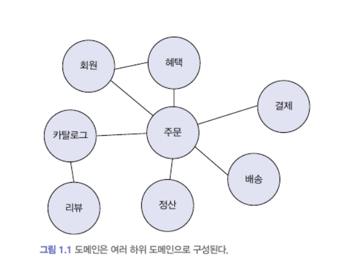

## 1.1 도메인이란?

도메인 = 소프트웨어로 해결하고자 하는 문제 영역

온라인 서점 = 구현해야하는 소프트웨어 = 큰 의미의 도메인

한 도메인은 다시 하위 도메인으로 나눌 수 있다. 

모든 기능을 직접 구현하지 않고 각자 필요한 영역을 개발하고, 서로 필요한 기능만 일부 연동하게 된다.

도메인마다 고정된 하위 도메인이 존재하는 것이 아니다. 

도메인의 구성 여부는 상황에 따라 달라진다. 

제공하고 싶은 기능, 대상, 규모, 기획 등에 따라서 도메인은 달라진다. 

## 1.2 도메인 전문가와 개발자 간 지식 공유

코딩 전, 요구사항을 올바르게 이해하는 것이 중요하다. 

개발자는 소프트웨어를 구현하지만, 실제로 해당 도메인에 대한 전문가(ex. 기획자)가 원하는 기능 개발을 요구한다.

따라서 개발자와 전문가가 직접 소통하는 것이 가장 요구사항을 올바르게 이해할 수 있는 방법이다.

그러기 위해 전문가와 이해관계자 그리고 개발자는 최소한의 도메인 지식을 갖춰야 한다. 

- Garbage in, Garbage Out = 잘못된 값이 들어가면 잘못된 결과가 나온다.
    
    전문가가 요구한 내용이 항상 올바른 것은 아니다. 실제로 전문가와의 대화를 통해 원하는 것이 무엇인지 파악하고 그러한 요구사항을 담을 수 있는 더 나은 방법을 찾는 것이 중요하다.
    

## 1.3 도메인 모델

도메인 모델 = 특정 도메인을 개념적으로 표현한 것 = 도메인 자체를 이해하기 위한 개념 모델 

도메인 모델을 사용하면 여러 관계자들이 도메인에 대한 지식을 공유하고 일치시키는 데 도움이 된다. 

표현방식은 중요하지 않다. 이해하는 것이 중요하다. 

큰 도메인은 다수의 하위 도메인으로 구성되기 때문에 정확한 도메인을 이해하기 위해서는 각 하위 도메인 마다 별도의 모델을 만들어야 한다.

## 1.4 도메인 모델 패턴

## 1.5 도메인 모델 도출

기획서, 유스케이스 등 요구사항과 전문가의 대화를 통해 도메인을 이해하는 것이 우선이다. 

도메인에 대한 초기 모델이 필요하다.

- 모델을 구성하는 핵심 구성요소, 규칙 기능을 찾는 것이다.
- 도메인을 구현하다 보면 특정 조건이나 상태에 따라 제약이나 규칙이 달리 적용되는 경우가 많다.

문서화를 하는 주된 이유는 지식을 공유하기 위함이다. 코드를 이용하여 소프트웨어를 분석하기에는 시간이 많이 소요한다. 따라서 코드 자체도 문서화의 대상으로 받아들이고 도메인 적으로 코드를 짠다면, 코드의 가독성이 높아지고 문서로서 코드가 의미를 갖게된다. 비로소 코드가 도메인을 이해하는 방법으로서 자리매김 할 수 있다.

## 1.6 엔티티와 밸류

도메인은 크게 엔티티와 밸류로 구분된다.

엔티티(Entity)

- 식별자를 갖는다. = 바뀌지 않고 고유하다
    - 특정 규칙에 따라 생성
    - UUID, Nano ID와 같은 고유 식별자 생성기
    - 값을 직접 입력
    - 일련번호 사용(auto increment)

밸류(Value)

- 개념적으로 완전한 하나를 표현할 때 사영한다.
- 꼭 두 개 이상의 데이터를 가져야하는 것은 아니다. 의미를 명확하게 표현하기 위해 사용하는 경우도 있다.
    - 식별자를 위한 밸류타입을 생성하여 값의 의미를 더 잘 드러나도록 할 수 있다.
- 밸류 타입을 위한 기능을 추가할 수 있다.
- 코드의 의미를 더 잘 이해할 수 있도록 한다.
- 밸류타입은 완전한 하나의 타입이기 때문에 안의 데이터를 부분적으로 변경하지 않고, 새로운 객체를 생성하여 변경하는 방식을 선호한다.

도메인 모델에는 피치못할 경우가 아니라면 setter는 지양하자. 

- 도메인의 핵심 개념이나 의도를 사라지게 한다.
- 도메인 객체가 온전하지 못한 상태가 될 수 있다.
- 생성시점에 필요한 모든 것을 전달해주어야만 생성 가능하도록 해야한다.
- 따라서 setter는 내부에서만 사용할 수 있도록 접근을 private로 하자
- 밸류 타입의 경우, 특별한 이유가 없다면 불변 객체로 만들자.

## 1.7 도메인 용어와 유비쿼터스 언어

단순히 순서라는 이유만으로 채번을 하는 것보다 의미가 있는 단어를 사용해 도메인 안의 내용을 구성하게 되면, 

코드를 도메인 용어로 해석하거나 반대로 용어를 코드로 해석하는 과정이 줄어든다.

= 가독성의 증가로 코드의 분석와 이해에 도움을 준다. 의미가 명확하니 눈에 보이는 버그 발생률도 적어지게 된다.

도메인 주도 설계에서는 이렇게 언어가 중요하다 따라서 

‘유비쿼터스 언어’라는 용어를 사용한다.

전문가 관계자 개발자가 모두 도메인과 관련된 공통의 언어를 서로 정의하여 동일한 용어를 사용하게끔 하는 것이다. 소통 과정에서의 모호성과 해석 과정 그리고 잘못 해석할 수 있는 여지를 줄일 수 있다.