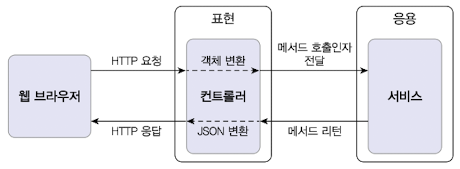
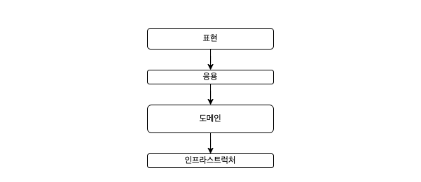
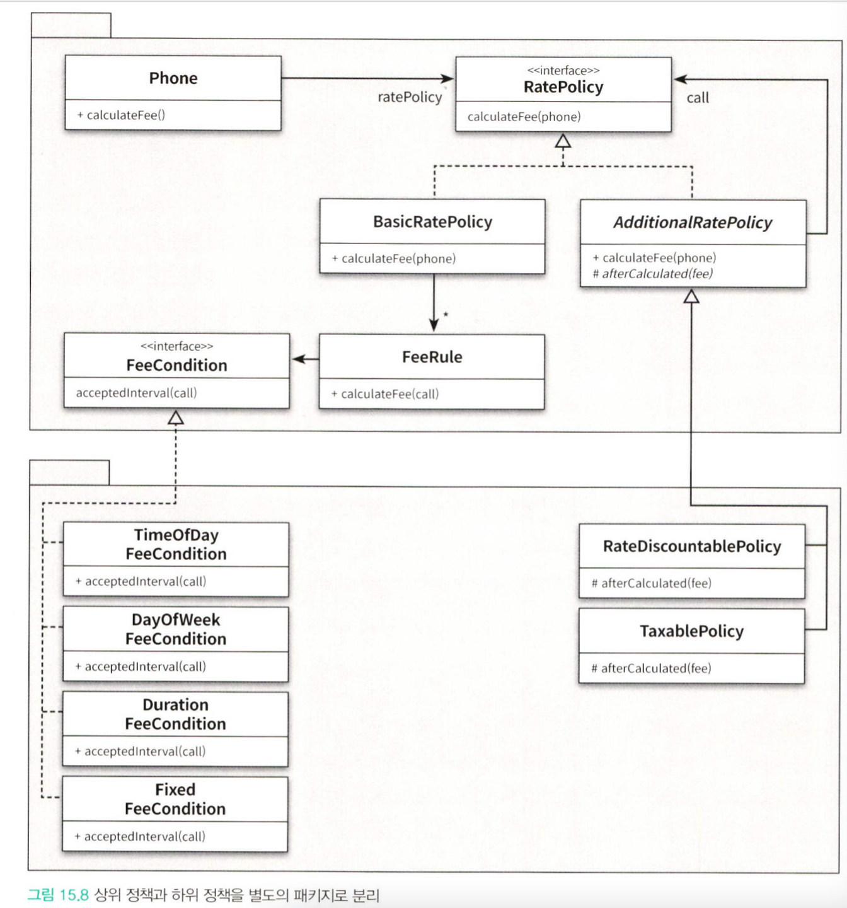

## 2.1 네 개의 영역



- **표현**

HTTP 요청을 응용 영역이 필요로 하는 형식으로 변환해서 응용 영역에 전달하고, 응용 영역의 HTTP 응답으로 변환하여 전송한다.

- **응용**

시스템이 사용자에게 제공해야 할 기능을 구현, 기능 구현을 위해 도메인 영역의 도메인 모델을 사용한다.

**로직을 직접 수행하기 보다는 도메인 모델에 로직 수행을 위임한다.**

- **도메인**

도메인 모델을 구현한다. 핵심 로직을 구현하게 된다. 

- **인프라스트럭처**

구현 기술에 대한 것을 다룬다. RDBMS, 외부 API 등

## 2.2 계층 구조 아키텍쳐



주로 표현과 응용 영역이 도메인 영역을 사용하고, 도메인 영역은 인프라스트럭처 영역을 사용한다. 

다만 계층구조의 특성상 상위 계층에서 하위 계층으로의 의존만 존재하고, 하위 계층은 상위 계층에 의존하지 않는다.

상황에 따라서 계층 구조를 유연하게 적용하기도 한다. 그렇게 된다면 응용 영역에서 인프라스트럭쳐를 의존하기도 한다. 

**문제점** 

- 표현, 응용, 도메인 계층이 상세한 구현 기술을 다루는 인프라스트럭처 계층에 종속된다.

응용, 도메인 영역에 인프라스트럭처 영역의 구현이 담기게 된다면, 각 서비스를 테스트 하는 곳에 인프라스트럭처에 필요한 초기설정 그리고 관련한 코드가 직접적으로 사용 된다. 이러한 구조는 테스트의 복잡성을 높게 한다. 또한 리팩토링과 기능 확장에 있어서 학습 러닝커브와 유지보수의 어려움을 야기한다.

 

**‘테스트의 어려움’과 ‘기능 확장의 어려움’의 문제를 마주하게 된다.** 

## 2.3 DIP

Dependency Inversion Principle

고수준(고객의 정보를 구한다.)  → 저수준 (RDBMS JPA를 이용, Drools로 룰 적용) 

**고수준 모듈 : 의미 있는 단일 기능을 제공하는 모듈이다.** 

**저수준 모듈 : 하위 기능을 실제로 구현한 것**

고수준 모듈이 동작하기 위해서는 저수준 모듈을 사용해야 한다. 하지만 고수준 모듈이 저수준 모듈을 사용하게 되면 계층 아키텍쳐의 문제였던 테스트와 구현 변경의 어려움을 마주하게 된다. 

**DIP는 저수준 모듈이 고수준 모듈에 의존하도록 한다.**

DIP를 구현하는 방법은 추상화한 인터페이스에 있다. 

```java
public interface RuleDiscounter {
	Money applyRules(Customer customer, List<OrderLine> orderLines);
}
```

```java
public class CalculateService {
	private RuleDiscounter ruleDiscounter;
	//생성자 코드 생략

	public Money calculateDiscount(List<OrderLine> orderLines, String customerId) {
		Customer customer = findCustomer(customerId);
		return ruleDiscounter.applyRules(customer, orderLines);
	} 
}
```

CalculateService는 기존의 Drools에 의존하는 코드가 없다. 또한 코드를 직접적으로 참조하는 것이 아니라 인터페이스의 정의된 메서드만 사용하고 있기 때문에 RuleDiscounter를 상속받아 구현하는 쪽에서의 코드를 알지 못한다. (구현체는 생성자에서 넣어준다.)

<aside>
💡 저수준 모듈이 고수준 모듈에 의존하게 된다.

</aside>

**기존의 계층구조 아키텍쳐는 고수준 모듈이 저수준 모듈을 의존하였는데 관계를 역전시켰기 때문에 DIP 의존 역전 원칙이라고 부른다.** 

```java
//사용할 저수준 객체 생성
RuleDiscounter ruleDiscounter1 = new DroolDiscounter();
RuleDiscounter ruleDiscounter2 = new AnotherDiscounter();

//생성자 방식으로 주입
CalculateService disService = new CalculateService(ruleDiscounter1);
CalculateService disService = new CalculateService(ruleDiscounter2);
```

이와 같이 추상 인터페이스를 사용하게 되면 테스트시, 저수준 객체를 Mock(가짜 대체)하여 실제 service에서 구현된 비즈니스 코드만 검증할 수 있다. 

DIP를 적용할 때 하위 기능을 추상화한 인터페이스는 고수준 모듈 관점에서 도출한다. 

> `DIP를 항상 적용할 필요는 없다. 구현 기술에 의존적인 코드를 도메인에 일부 포함하는 것이 효과적일 때도 있다. 또한 추상화 대상이 잘 떠오르지 않을 때에는 시도보다는 이점을 얻는 수준에서의 적용범위를 검토하자`
> 

- 오브젝트 내에서 DIP를 구현한 내용을 예시자료로 첨부한다.  (오브젝트 15장 발췌)

상위정책은 상대적으로 변경에 안정적이지만 세부사항은 자주 변경된다. 

따라서 상위 정책이 자주 변하는 세부 사항에 의존한다면 변경에 대한 파급효과로 인해 상위 정책이 불안정해질 것이다.

이를 위한 가장 좋은 방법은 상위 정책과 세부 사항 모두 추상화에 의존하게 만드는 것이다. 

변하는 것과 변하지 않는 것을 서로 분리하여 별도의 패키지로 분리한다.



## 2.4 도메인 영역의 주요 구성요소

|  ENTITY |  고유의 식별자를 가자는 객체, 도메인의 고유한 개념을 표현한다. 데이터와 관련된 기능과 데이터를 포함한다.  |
| --- | --- |
| VALUE | 식별자를 갖지 않는 객체, 개념적으로 하나인 값을 표현, 엔티티의 속성으로 사용되며, 다른 밸류타입의 하위 속성으로도 사용한다.  |
| AGGREGATE | 연관된 엔티티와 벨류 객체를 하나로 묶는 것이다. 엔티티 + 밸류 |
| REPOSITORY | 도메인 모델의 영속성을 처리한다.  RDBMS 테이블의 엔티티 객체를 로딩하거나 저장 |
| DOMAIN SERVICE | 특정 엔티티에 속하지 않은 도메인 로직을 제공한다. 여러 엔티티와 밸류가 필요한 로직들을 구현하는 공간이다.  |

**실제 도메인인 모델의 엔티티와 DB 관계형 모델의 엔티티는 같은 것이 아니다.** 

도메인 모델의 엔티티 - 데이터와 함께 도메인 기능을 함께 제공한다. 

단순히 데이터를 담고있는 구조라기보다는 데이터와 함께 기능을 제공하는 객체이다. 

도메인 관점에서 기능을 구현하고, 기능 구현을 캡슐화해서 데이터가 임의로 변경되는 것을 막는다.

도메인 모델의 엔티티는 두 개 이상의 데이터가 개념적으로 하나인 경우 밸류타입을 이용해 표현이 가능하다. 

**애그리거트**

- 도메인이 커질수록 개발한 도메인 모델이 커지며 많은 엔티티와 밸류가 출현하게 된다.
- 애그리거트는 관련 객체를 하나로 묶은 군집이다.
- 예를들어 주문은 배송지 정보, 주문 정보, 결제 금액 등의 하위 모델을 포함한다.
- 애그리거트를 사용하면 객체 군집단위로 모델을 바라볼 수 있게 된다.
- 애그리거트는 루트 엔티티를 갖는다
- 루트엔티티란 애그리거트에 속해앴는 엔티티와 밸류 객체를 이용해 애그리거트가 구현해야 할 기능을 제공한다.
- 내부구현을 숨겨 애그리거트 단위로 구현을 캡슐화 할 수 있도록 돕는다.

리포지터리는 도메인 모델 관점에서 도메인 객체를 영속화 하는 데 필요하므로 고수준 모듈에 속한다. 

- 응용서비스는 필요한 도메인 객체를 구하거나 저장할 때 리포지터리를 사용한다.
- 응용서비스는 트랜잭션을 관리하는데, 처리는 리포지터리 구현 기술의 영향을 받는다.

## 2.5 요청 처리 흐름

예매하기나 예매 취소와 같은 기능을 제공하는 응용 서비스는 도메인의 상태를 변경하므로 변경 상태가 물리 저장소에 올바르게 반영되도록 트랜잭션을 관리해야한다. Spring은 @Transactional을 이용한다.

## 2.6 인프라스트럭처 개요

구현의 편리하는 DIP가 주는 다른 장점만큼 중요하기 깨문에 DIP의 장점을 해치지 않는 범위에서 응용 영역과 도메인 영역에서 구현 기술에 대한 의존을 가져가는 것이 나쁘지 않다. 케이스에 따라 다르다

## 2.7 모듈 구성

모듈 구조에 대한 규칙은 없다. 한 패키지에 가능하면 10- 15개의 타입 개수를 유지하려고 한다.