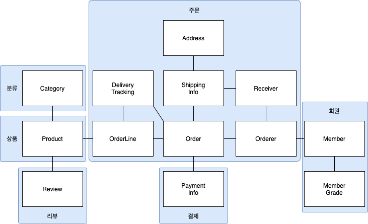

## 3.1 애그리거트

개별 객체 수준에서 모델을 바라보면 상위 수준에서 관계를 파악하기 어렵다. 

도메인 객체 모델이 복잡해지면 개별 구성요소 위주로 모델을 이해하게 되고, 전반적인 구조나 큰 수준에서 도메인 간의 관계를 파악하기 어려워진다. 



애그리거트는 관련된 객체를 하나의 군으로 묶는다.

수 많은 객체를 애그리거트로 묶어서 바라보면 상위수준에서 도메인 모델 간의 관계 파악에 용이하다.

- 모델의 이해에 도움을 줌.
- 일관성을 관리하는 기준이 된다.

애그리거트는 경계를 갖는다. 따라서 한 애그리거트에 속한 객체는 다른 애그리거트에 속하지 않는다.

애그리거트는 독립된 객체 군이다.

자기 자신을 관리할 뿐 다른 애그리거트를 관리하지 않는다. 

도메인 규칙과 요구사항이 경계를 설정할 때 기본이 된다. 


A가 B를 갖는다 라고 설계할 수 있는 요구사항이 있다면 A와 B가 한 애그리거트라고 생각되기 쉽다. 

예를 들어 상품과 상품리뷰의 경우, 상품이 상품 리뷰를 갖는다라고 생각할 수 있다. 하지만 실제 상품의 경우 관리자가 조작을 하고, 상품 리뷰의 경우 고객이 작성하게 된다. 생성 시점과 변경 주체가 다르기 때문에 서로 다른 애그리거트에 속한다.

<aside>
💡 다수의 애그리거트가 한 개의 엔티티 객체만 갖는 경우가 많았으며, 두 개 이상의 엔티티로 구성되는 애그리거트는 드물었다.

</aside>

---

## 3.2 애그리거트 루트


애그리거트는 여러 객체로 구성되기 때문에 한 객체만 정상이면 안된다. 

도메인 규칙을 지키려면 애그리거트에 속한 모든 객체가 정상 상태를 가져야한다. 

애그리거트에 속한 모든 객체가 일관된 상태를 유지하려면 애그리거트 전체를 관리할 주체가 필요하다. 이 책임을 지는 것이 **애그리거트의 루트 엔티티**이다. 

애그리거트에 속한 객체는 루트 엔티티에 직접 또는 간접적으로 속하게 된다.

### 3.2.1 도메인 규칙과 일관성

애그리거트 루트의 핵심 역할

- 일관성이 깨지지 않도록 하는 것
- 애그리거트가 제공해야할 도메인 기능을 구현한다.

방법

- 애그리거트 외부에서 애그리거트에 속한 객체를 직접 변경하면 안 된다. : 모델의 일관성을 깨는 원인

```java
ShippingInfo si = order.getShipingInfo();
si.setAddress(newAddress);
```

order의 주문 상태를 확인하여, 배송지 입력 가능 여부를 판단해야한다. 하지만 set 메서드로 주소를 바로 수정하게 되면 상태에 따른 입력 가능여부가 무시된다. 즉 논리적인 데이터 일관성이 깨지며 이는 모델의 일관성이 깨지는 것과 동일하다. 

```java
ShippingInfo si = order.getShipingInfo();

if(state != OrderState.PAYMENT_WAITING && ... ){
	throw new IllegalArgumentException();
}
si.setAddress(newAddress);
```

상태 확인 로직을 넣어서 일관성을 지켜보려고 코딩할 수 있으나, 이는 다른 곳에서도 중복으로 구현할 가능성이 높기 때문에 유지보수에 도움이 되지 않다. *(오히려 관리 포인트만 늘어나게 된다.)*

**불필요한 중복을 피하고 애그리거트 루트를 통해서만 도메인 로직을 구현하는 법**

- **단순 변경 set 메서드를 public으로 만들지 않는다.**

공개 set 메서드는 도메인의 의미나 의도를 표현하지 못하고, 도메인 객체가 아닌 영역으로 분산시킨다. 

따라서 유지보수와 분석에 더 많은 공수가 들어가게 된다. 

공개 set 메서드를 사용하지 않는다면, 의미가 드러나는 메서드를 사용해서 구현할 가능성이 높아진다. 

- **밸류타입은 불변으로 구현한다.**

밸류 객체의 값이 변경이 불가능하다면, 외부에서 밸류 객체의 상태를 변경할 수 없다. 

따라서 밸류 타입의 내부 상태를 변경하기 위해서는 애그리거트 루트를 통해서만 가능하다. 

### 3.2.2 애그리거트 루트의 기능 구현

애그리거트 루트는 애그리거트 내부의 다른 객체를 조합해서 기능을 완성한다.

구성요소의 상태만 참조하는 것이 아니라, 기능 실행을 위임하기도 한다. 

```java
public class Order {
	private OrderLines orderLines;

	public void changeOrderLines(List<OrderLine> newLines){
		orderLines.changeOrderLines(newLines);
		this.totalAmounts = orderLines.getTotalAmounts();
	}

}
```

> 만약 밸류 타입을 불변으로 구현할 수 없는 상황이라면 밸류 객체의 변경기능을 패키지나 protected 범위로 한정하여 외부에서 실행 할 수 없도록 제한할 수도 있다.
> 

### 3.2.3 트랜잭션 범위

**트랜잭션 범위는 작을 수록 좋다.**

- 성능에서의 차이가 발생한다. (여러 테이블을 수정할 수록 잠가야하는 대상이 늘어난다)
- 한 트랜잭션에서는 한 개의 애그리거트만 수정해야한다.
    - 애그리거트에서 다른 애그리거트를 변경하지 않는 것을 의미한다.
    - 애그리거트는 서로 독립적이어야 하는데 한 애그리거트가 다른 애그리거트의 기능에 의존하기 때문에 결합도가 높아진다.
- 한 트랜잭션에서 두 개 이상의 애그리거트를 수정해야 한다면, 응용서비스에서 두 애그리거트를 수정하도록 구현한다.

```java
public class ChangeOrderService{
	@Transactional
	public void changeShippingInfo(OrderId id, ShippingInfo newInfo, boolean isUse){
		Order order = orderRepository.findById(id);
		order.shipTo(newInfo);
		if(isUse){
			Member member = findMember(order.getOrderer);
			member.changeAddress(newInfo.getAddress);
		}
	}
}
```

다음의 경우 한 트랜잭션에서 두 개 이상의 애그리거트를 변경하는 것을 고려할 수 있다.

- **팀 표준** : 팀이나 조직의 표준에 따라 응용서비스의 기능을 한 트랙잭션에서 수행해야 할 경우
- **기술 제약** : 기술적으로 이벤트 방식을 도입할 수 없는 경우, 한 트랜잭션에서 다수의 애그리거트를 수정해서 일관성을 처리
- **UI 구현의 편리** :  사용자의 편리함을 위해 한 트랜잭션에서 여러 애그리거트의 상태를 변경할 수 있다.

---

## 3.3 리포지터리와 애그리거트

애그리거트는 개념상 완전한 한 개의 도메인 모델을 표현하므로 객체의 영속성을 처리하는 **리포지터리는 애그리거트 단위로 존재한다.** 

애그리거트는 개념적으로 하나이므로 리포지터리는 애그리거트 전체를 저장소에 영속화해야한다.  애그리거트를 저장할 때 애그리거트 루트와 매핑되는 테이블 뿐만 아니라 애그리거트에 속한 모든 구성요소에 매핑된 테이블에 데이터를 저장해야 한다. 

리포지터리는 완전한 애그리거트를 제공해야한다. : 그렇지 않으면 참조시 NullPointerException 발생

---

## 3.4 ID를 이용한 애그리거트 참조

애그리거트도 다른 애그리거트를 참조한다.

애그리거트 간의 참조는 필드를 통해 구현 가능하다.

하지만 필드를 이용한 애그리거트 참조의 문제 야기

- 편한 탐색 오용 : 다른 애그리거트의 상태를 쉽게 변경할 수 있음, 의존 결합도 높임
- 성능에 대한 고민 : 지연 로딩과 즉시 로딩을 결정해야함.
- 확장 어려움 : 하위 도메인별로 시스템을 분리하게 된다면, JPA같은 단일 기술을 사용하기 어려움.

이를 위한 방법 : ID를 이용해서 다른 애그리거트를 참조하자!

ID참조를 이용하면 

- 물리적인 연경을 제거하기 때문에 모델의 복잡도를 낮춘다.
- 애그리거트간 의존을 제거하기 때문에 응집도를 높여주는 효과도 존재한다.
- 구현 복잡도도 낮아진다. 지연/즉시 로딩에 대한 고민이 없어진다. (응용서비스에 ID로 알아서 로딩하면 됨)
- 다른 애그리거트를 수정하는 문제를 근원적으로 방지할 수 있다.
- 서로 다른 구현 기술을 사용 가능하다. (RDBMS든 NoSQL이든 ID로 검색만 하면 됨)

### 3.4.1 ID를 이용한 참조와 조회 성능

**N+1문제**

- ID 참조를 하게되면 하위 데이터를 가져오기 위한 추가 쿼리 실행이 필요하다
- 예를 들어 1개의 주문에 10개의 상품이 묶여있는 경우, 상품의 정보를 보기 위해서는 주문 find 1번, 상품 find 10 번 = 11번의 조회 쿼리가 필요하다.
- 조회대상이 N개일 때 N개를 읽어오는 한 번의 쿼리와 연관된 데이터를 읽어오는 쿼리를 N번 실행한다.
- 전체 조회 속도가 느려지는 원인.
- 조인을 이용하면 개선 가능 : 가장 쉬운 방법은 ID 참조에서 객체참조로 변경하고 즉시로딩으로 변경하는 것. 하지만 기존의 참조를 이용한 애그리거트 문제로 다시 돌아가게 된다.
- 따라서 조회 전용 쿼리를 사용하면 된다.
    - 별도의 DAO를 만들고 조인을 이용한 한 번의 쿼리로 필요한 데이터를 로딩하면 된다.

애그리거트마다 서로 다른 저장소를 사용하면 한 번의 쿼리로 관련 애그리거트를 조회할 수 없다. 이때는 조회 성능을 높이기 위해 캐시를 적용하거나 조회 전용 저장소를 따로 구성한다. 

---

## 3.5 애그리거트 간 집합 연관

**1:N, M:N 연관이 있는 경우(Collection)**

```java
public class Category{
	private Set<Product> products;

	public List<Product> getProducts(int page, int size) {
		List<Product> sortedProducts = sortById(products);
		return sortedProducts.subList(page - 1)*size, page*size)
	}
}
```

페이징을 구현하기 위해서 카테고리 밑의 모든 product를 로딩 한 뒤, 사이즈를 자르는 방식은 product의 갯수가 많아질 수록 성능의 문제를 야기한다. 

따라서 개념적으로 1:N인 경우, N:1로 연관지어 생각한다. 

```java
public class Product{
	private CategoryId categoryId;
}
```

```java
public class ProductListService {
	public Page<Product> getProductCategory(Long categoryId, int page, int size){

		Category category = categoryRepository.findyId(categoryId);
		checkCategory(category);
		List<Product> products = productRepository.findByCategoryId(category.getId(), page, size);
		int totalCount = productRepository.countsByCategoryId(category.getId());
		return new Pagew(page, size, totalCount, products);
	}
}
```

**M:N 연관은 개념적으로 양쪽 애그리거트에 컬렉션으로 연관을 만든다.** 

개념적으로는 양방향 M:N 연관이 존재하지만, 실제 구현에서는 상품에서 카테고리로의 단방향 M:N연관만 적용하면 된다. 

RDBMS에서 M:N은 조인 테이블을 사용하여 구현한다. 

목록이나 상세화면과 같은 조회 기능은 조회 전용 모델을 이용해서 구현하는 것이 좋다.

---

## 3.6 애그리거트를 팩토리로 사용하기

```java
public class RegisterProductService{

	public ProductId registerNewProduct(NewProductReqeust req){

		Store store = storeRepository.findById(req.getStoreId());
		checkNull(store);
		if(store.isBlocked()){
			throw new StoreBlockedException();
		}
		ProductId id = productRepository.nextId();
		Product product = new Product(id, store.getId() ... );
		productRepository.save(product);
		return id;
	}
}
```

상점 상태가 차단이 아닌 경우에만 상품을 생성하는 로직이다. store의 block 여부를 판단하여 Product를 생성한다. 애그리거트별로 구현이 분리되어있다. 하지만

중요한 도메인 로직 처리가 응용 서비스에 노출되었다.

```java
public class Store{
	public Product createProduct(ProductId id, ... ) {
		if (!account.isBlocked()) {
			throw new StoreBlockedException();
		}
		return new Product(id, account.getId(), ...);
	}
}
```

Store 안에서 Product를 생성하게 된다면 상태 판단 이후 생성하는 주요 로직이 노출되지 않게 된다.  createProduct()는 Product의 생성 팩토리 역할이 된다. 

애그리거트가 갖고 있는 데이터를 이용해서 다른 애그리거트를 생성해야 한다면 애그리거트에 팩토리 메서드를 구현하는 것을 고려해보자, 

또는 애그리거트를 직접 생성하지 않고 다른 팩토리에 위임하는 방법도 있다.

질문 : 같은 도메인이면 다른 애그리거트여도 자신이 아닌 다른 곳에서 생성이 가능한건가 ??????? 이해가 안된다.