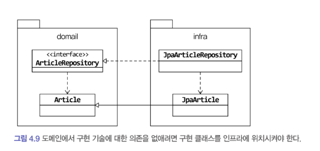

## 4.1 JPA를 이용한 리포지터리 구현

리포지터리 인터페이스는 애그리거트와 같이 도메인 영역에 속하고, 리포지터리를 구현한 클래스는 인프라스트럭처 영역에 속한다.

가능하면 리포지터리 구현 클래스를 인프라스트럭처 영역에 위치시켜서 인프라스프럭처에 대한 의존을 낮춰야 한다. 

### **리포지터리가 제공하는 기본 가능**

- ID로 애그리거트 조회하기
- 애그리거트 저장하기

**인터페이스는 애그리거트 루트를 기준으로 작성한다.** 

```java
public interface OrderRepository {
	Order findById(OrderNo no);
	void save(Order order);
	void delete(Order order);
}
```

인터페이스를 구현한 클래스는 JPA의 EntityManager를 이용하여 구현한다. (코드 생략)

JPA는 트랜잭션 내의 범위에서 변경한 데이터를 자동으로 DB에 반영하기 때문에 수정 반영 메서드는 추가하지 않아도 된다. 

ID외에 다른 조건으로 애그리거트를 조회할 때에는 JPA의  Criteria나 JPQL을 사용할 수 있다.

## 4.2 엔티티와 밸류 매핑

**Spring Data JPA**를 사용하면

지정된 규칙에 맞게 리포지터리 인터페이스를 정의하면 리포지터리를 구현한 객체를 알아서 만들어 스프링 빈으로 등록해준다. 

- org.springframework.data.repository.Repository<T, ID> 인터페이스 상속
- T는 엔티티 타입을 지정하고, ID는 식별자 타입을 지정

```java
@Entity
@Table
public class Order {
	@EmbeddedId
	private OrderNo number; // OrderNo가 식별자 타입
}
```

```java
public interface OrderRepository extends Repository<Order, OrderNo> {
	Optional<Order> findById(OrderNo no);
	void save(Order order);
	void delete(Order order);
}
```

스프링 데이터 JPA는 OrderRepository를 레포지터리로 인식해서 알맞게 구현한 객체를 스프링 빈으로 등록한다. 

```java
@Service
public class CancelOrderService {
	private OrderRepository orderRepository; 

	public void create(.. ) {
	
		orderRepository.findById(req.getId());
	}
}
```

---

## 4.3 매핑 구현

애그리거트와 JPA 매핑을 위한 기본 규칙은 다음과 같다. 

- 애그리거트 루트는 엔티티이므로 @Entity로 매핑 설정한다.

한 테이블에 엔티티와 밸류 데이터가 같이 있다면

- 밸류는 @Embeddable로 매핑 설정한다.
- 밸류 타입 프로퍼티는 @Embedded로 매핑 설정한다.

```java
@Embeddable
public class Orderer {
	
	@Embedded
	@AttributeOverrides(
		 @AttributeOverride( name="id", column = @Column(name="orderer_id"))
	private MemberId memberId;

	@Column(name="orderer_name")
	private String name;
}
```

```java
@Embeddable
public class MemberId implements Serializable {

	@Column(name="member_id")
	private String id;
}
```

밸류 타입의 경우 불변타입으로 생성시점에 필요한 값을 모두 전달받기 때문에 set메서드를 제공하지 않는다. 이는 기본생성자(파라미터가 없는)를 추가할 필요가 없다는 뜻과 동일하다.

하지만 JPA에서 @Entity와 @Embeddable로 클래스를 매핑하려면 기본 생성자를 제공해야한다.  

DB에서 데이터를 읽어와 매핑된 객체 생성시, 기본 생성자가 필요하다. (JPA 프로바이더가 객체를 생성할 때만 사용) 

다른 코드에서 기본 생성자를 사용하지 못하도록 **protected**로 선언한다.

```java
@Embeddable
public class Orderer {
	
	@Embedded
	@AttributeOverrides(
		 @AttributeOverride( name="id", column = @Column(name="orderer_id"))
	private MemberId memberId;

	@Column(name="orderer_name")
	private String name;

	protected Orderer() {}
}
```

JPA는 필드와 메서드의 두 가지 방식으로 매핑을 처리할 수 있다.

1. 메서드 방식 이용 (get/set 메서드)

```java
@Entity
@Access(AccessType.PROPERTY)
public class Order {

	@Column(name = "state")
	@Enumerated(EnumType.STRING)
	public OrderState getState() {
		return state;
	}

	public void setState(OrderState state) { 
		this.state = state;
	}
}
```

공개 get,set 메서드는 도메인의 의도가 사라지고 DDD를 해칠 가능성이 높아진다. 

**특히 set 메서드는 캡슐화를 깨는 원인이 될 수 있다.**

따라서 set 메서드보단 의도가 잘 들어나는 메서드를 만들어야 한다. 또한 밸류타입의 경우 불변이어야 하기 때문에 set 메서드를 추가하는 것이 좋지 않다. 

객체가 제공할 기능 중심으로 엔티티를 구현하게끔 유도하기 위해서는 JPA 매핑 처리를 프로퍼티 방식이 아닌 필드 방식으로 선택해서 불필요한 get/set 메서드 구현을 지향한다.

<aside>
💡 **JPA 구현체인 하이버네이트는 @Access를 이용하여 명시적으로 접근 방식을 지정하지 않으면 @Id 나 @EmbeddedId가 어디에 위치했느냐에 따라 접근 방식을 결정한다. 필드에 위치하면 필드, get메서드에 위치하면 메서드 접근 방식을 선택한다.**

</aside>

### AttributeConverter를 이용한 밸류 매핑 처리

밸류타입의 프로퍼티를 한 개의 컬럼에 매핑하는 방법

```java
public class Length{
	private int value;
	private String unit;
}

-> WIDTH VARCHAR(20) (1000mm로 저장) 
```

AttributeConverter는 밸류 타입과 컬럼 데이터 간의 변환을 처리하기 위한 기능을 정의한다.

```java
X → 밸류 타입
Y → DB 타입

public interface AttributeConverter<X, Y> {
	// 밸류 타입을 DB타입으로 변환하는 기능 
	public Y convertToDatabaseColumn(X attribute);
	// DB타입을 밸류 타입으로 변환하는 기능 
	public X convertToEntityAttribute(X attribute);
}
```

```java
public class Order {
	@Column(name="total_amounts")
	@Convert(converter = LengthConverter.class)
	private Length length;
}
```

### 별도 테이블 매핑

```java
public class Order {
	private List<OrderLine> orderLines;
}
```

밸류 컬렉션을 별도 테이블로 매핑할 때는 **@ElementCollection**과 **@CollectionTable**을 사용

```java
@Entity
public class Order {
	@EmbeddedId
	private OrderNo number; 

	@ElementCollection(fetch = FetchType.EAGER)
	@CollectionTable( name = "order_line", 
											joinColumns = @JoinColumn(name="order_number"))
	@OrderColumn(name = "line_idx")
	private List<OrderLine> orderLines;
}
```

OrderLine에는 List의 인덱스 값을 저장하기 위한 프로퍼티가 존재하지 않는다. List타입 자체가 인덱스를 갖고 있기 때문이다 

**@OrderColumn** - 지정한 컬럼에 리스트의 인덱스 값을 저장

**@CollectionTable** - 밸류를 저장할 테이블을 지정

**name** - 테이블 이를을 지정

**joinColumns** - 외부키로 사용할 컬럼 지정

**@JoinColumn**의 배열을 이용하여 외부키 목록 지정

### 한 개 컬럼 매핑

AttributeConverter 이용

### 밸류를 이용한 ID매핑

식별자 의미를 부각시키기 위해 식별자를 밸류 타입으로 만드는 경우

**@EmbeddedId** 사용 

JPA의 식별자 타입은  Serializable 타입이어야 하기 때문에 인터페이스를 상속받아야 한다. 

```java
@Embeddable
public class MemberId implements Serializable {

	@Column(name="member_id")
	private String id;
}
```

---

## 4.4 애그리거트 로딩 전략과 영속성 전파

애그리거트에 속한 객체가 모두 모여야 완전한 하나가 된다.

```java
Product product = productRepository.findById(id);
```

조회시점에 애그리거트를 완전한 상태가 되도록 하려면 애그리거트 루트에서 연관 매핑의 조회방식을 **FetchType.EAGER**로 설정하면 된다.  (루트 조회 시점에 함께 join)

Collection 타입의 매핑관계의 경우,  EAGER로 조회하게 되면, **Cartesian** 조인을 사용하고, 쿼리를 중복을 발생시킨다. 애그리거트의 크기가 커질 수록 중복데이터의 크기가 급격하게 늘어나기 때문에 데이터 개수가 많을 경우, 즉시 로딩 방식 사용 성능을 검토해봐야 한다. 

애그리거트는 개념적으로 하나여야한다. 하지만 로딩 시점에 모두 로딩해야하는 것은 아니다. 

### 애그리거트가 완전해야하는 이유

1. 상태를 변경하는 기능을 실행할 때 애그리거트 상태가 완전해야 하기 때문이다.
2. 표현의 영역에서 애그리거트의 상태 정보를 보여줄 때 필요하다.

2번의 경우 별도의 조회 전용 기능과 모델을 구현하는 방식이 더 유리하다. 

상태변경 기능을 사용하기 위해 조회시점에 즉시 로딩을 이용해서 애그리거트를 완전한 상태로 로딩할 필요는 없다  JPA는 트랜잭션 범위 내에서 지연 로딩을 허용하기 때문에 필요한 구성요소만 로딩해도 문제가 되지 않는다 **(FetchType.EAGER)**

지연로딩은 즉시로딩보다 쿼리 실행 횟수가 많아질 가능성이 더 높다. 따라서 애그리거트에 맞는 즉시 로딩과 지연 로딩을 선택해야 한다. 

---

## 4.5 애그리거트의 영속성 전파

- 저장 메서드는 애그리거트에 속한 모든 객체를 저장해야 한다.
- 삭제 메서드는 애그리거트에 속한 모든 객체를 삭제해야 한다.

```java
@OneToMany(cascade = {CascadeType.PERSIST, CascadeType.REMOVE}, 
																							orphanRemoval = true)
```

---

## 4.6 식별자 생성 기능

- 사용자가 직접 생성
- 도메인 로직으로 생성
- DB를 이용한 일련번호 사용

DB 자동 증가 컬럼 식별자로 사용하려면 **@GeneratedValue**를 사용한다.

---

## 4.7 도메인 구현과 DIP

DIP에 따르면 **@Entity, @Table, @ Id, @Column** 구현 기술에 속하므로 Article과 같은 도메인 모델은 구현기술인 JPA에 의존하지 말아야 하는데 이 코드는 영속성 구현 기술인 JPA 의존하고 있다. 

Repository 인터페이스도 마찬가지다 JPA 인터페이스를 상속하는 것이, 즉 도메인이 인프라 의존하는 것이다.



DIP를 적용하는 주된 이유는 저수준 구현이 변경 되더라도  고수준이 영향을 받지 않도록 하기 위함이다. 하지만 리포지터리와 도메인 모델의 구현 기술은 거의 바뀌지 않는다. 필자도 JPA로 구현한 리포지터리 구현기술을 마이바티스나 다른 기술로 변경한 적 없고 RDBMS를 사용하다 몽고 디비로 변경한 적도 없다. 이렇게 변경이 거의 없는 상황에서 변경을 미리 대비하는 것은 과하다. 

JPA 전용 애너테이션을 사용하긴 했지만 도메인 모델을 단위 테스트하는 데 문제는 없다. JPA에 맞춰 도메인 모델을 구현해야할 때도 있지만 상황이 드물다. 리포지터리 자체는 인터페이스이고, 테스트 가능성을 해치지 않는다.